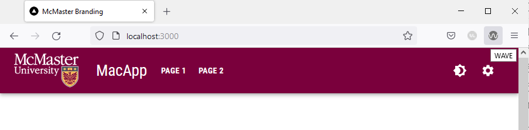
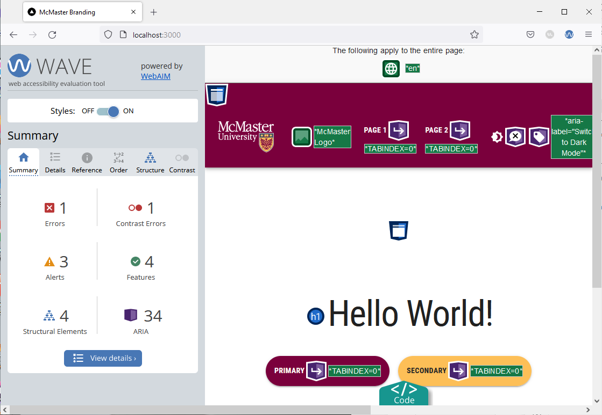
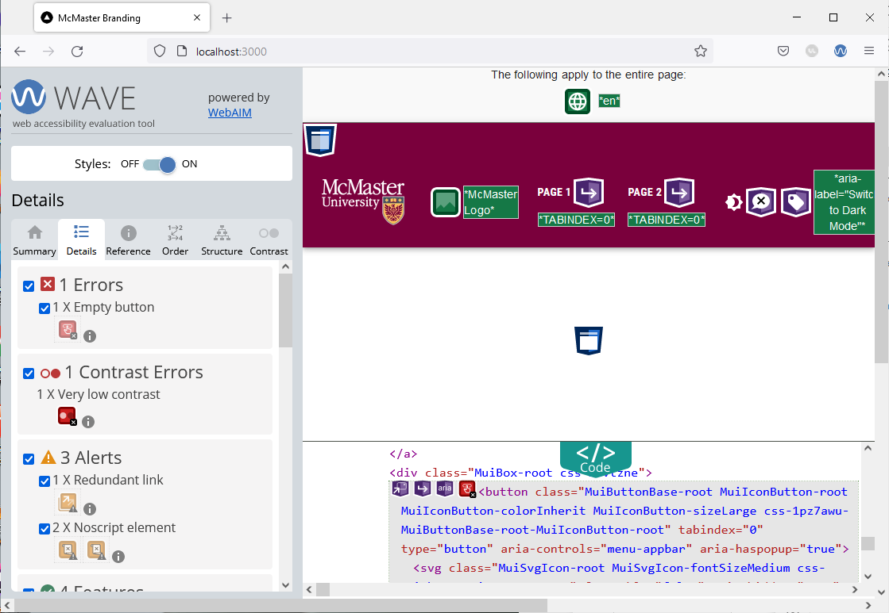
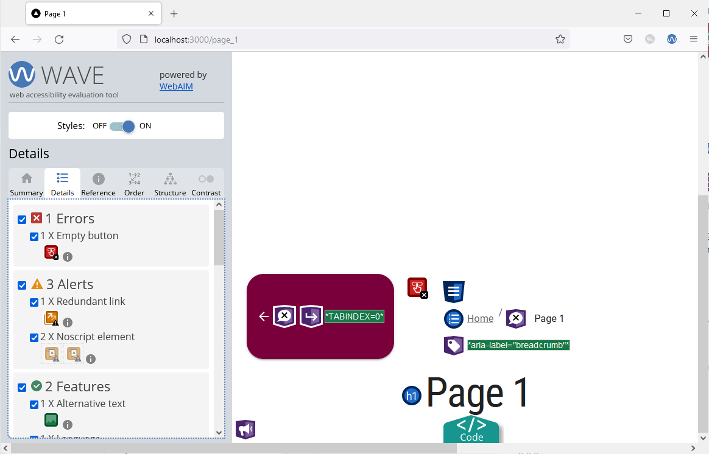
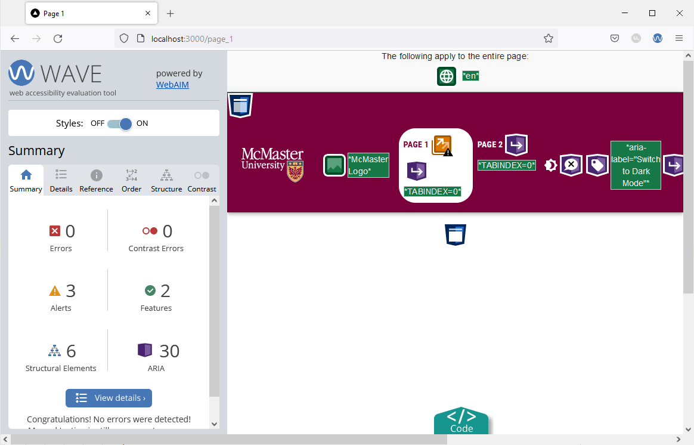
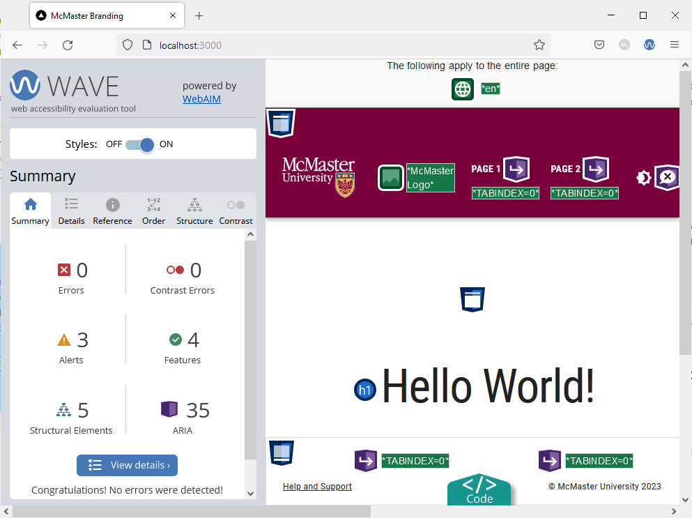
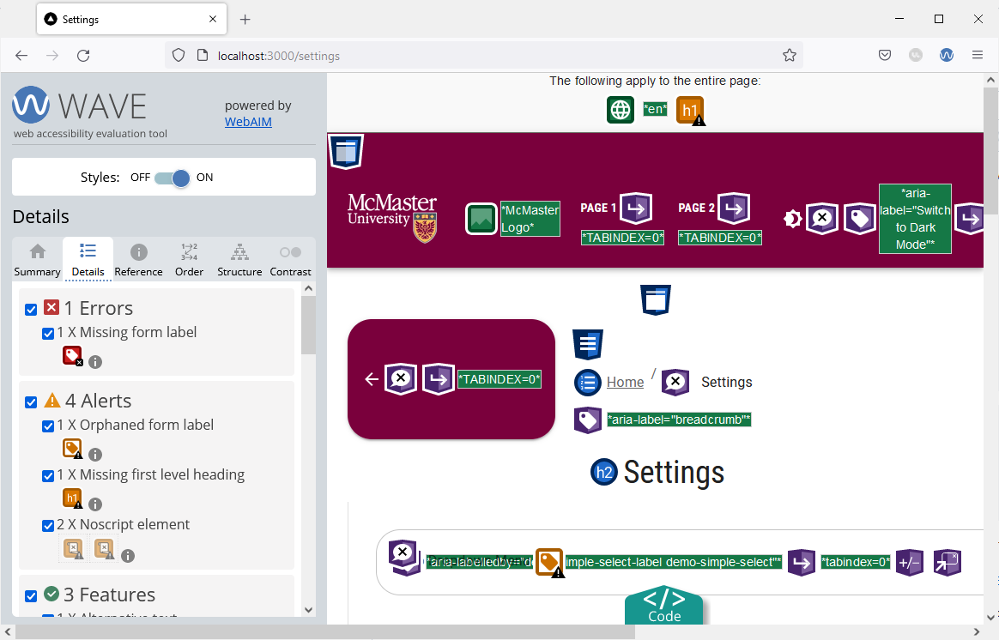

# AODA Compliance 

Accessibility is crucial for websites as it ensures that everyone, regardless of their abilities or disabilities, can perceive, navigate, and interact with digital content effectively. Prioritising accessibility aligns with ethical and legal obligations, such as the AODA Integrated Standards Regulation released in June 2011 by the Ontario legislative body, which requires McMaster University to provide information in an accessible format. Implementing accessibility features, such as alt text for images, captions for videos, keyboard navigation, and clear, structured content, not only enables people with disabilities to access information but also enhances the user experience for all visitors. Ultimately, accessibility isn't just a checkbox; it's a fundamental aspect that empowers individuals and contributes to a more accessible and welcoming digital landscape. In this section, we will learn how to evaluate a website for AODA compliance and how to address some common AODA errors related to MUI components, ensuring the website's accessibility and compliance with AODA standards.

## Installing the Wave Browser Extension
Open the [WAVE Extensions ](https://wave.webaim.org/extension/) webpage and install the Wave extension for the browser that you are currently using. 

## Using the Wave Browser Extension
To evaluate a page, simply click on the extension button in your browser's toolbar.

The Wave sidebar will be shown on the left side of your browser. The sidebar includes a summary of all the errors, alerts and features that are present on the page you have open.

You will need to evaluate all pages of your website across their different variations using this tool. For instance, if your website has a light and a dark mode, you will need to evaluate each page in both modes. Furthermore, if you have some UI elements that only appear in certain conditions (e.g., mobile/tablet UI, etc.), you will will have to evaluate each page in all its variations. 

In our case, the Wave tool identifies 1 regular error and 1 contrast error as shown in the image below. 


Open the "Details" tab in the Wave sidebar to find more details regarding the errors and alerts. We can now see that the error is caused by an empty button, i.e., a button without any text or tooltip message. Screen readers cannot properly process empty buttons, so we will need to address this issue to ensure that our website meets the accessibility standards.

Pull the website's HTML code by clicking on the turquoise "Code" button at the bottom of the screen. With the code view pulled up, click on the red button under "1 X Empty button" and you will redirected to the HTML code section that corresponds to the empty button. 



## Empty Button Error
After inspecting the code, we found that the empty button is the "Menu" button that appears on the navigation bar on smaller screens. To fix the issue, we will add a tooltip message to the "Menu" button.

Open the `Navbar.tsx` file located under `components/Navbar`, and wrap the `IconButton` component containing a `MenuIcon` with a `Tooltip` component as shown below:
```ts
<Tooltip enterDelay={500} title={state ? "Close App Drawer" : "Open App Drawer"}>
	<MacIconNavButton
		size="large"
		aria-controls="menu-appbar"
		aria-haspopup="true"
		onClick={handleOpenNavMenu}
		color="inherit"
>
		<MenuIcon />
	</MacIconNavButton>
</Tooltip>
```

Save the file and go back to your browser. Reload the webpage and re-evaluate it using the Wave tool. The "Empty Button" error will no longer be present. 


Navigate to "Page 1" and re-evaluate the page using the Wave tool. The summary page shows another empty button error. Examining the code shows that the error is caused by the back button.



While we can use a tooltip message to resolve this issue, we will show another way of addressing the problem.

Open the `components/BreadCrumbs/BreadCrumbs.tsx` file and locate the `MacButton` component containing an `ArrowBackIcon`. Add a `title` prop to the `MacButton` component:
```ts
<MacButton variant="contained" mainColor="primary" onClick={() => router.back()} title={"Back"}>
    <ArrowBackIcon />
</MacButton>
```

Go back to your browser and try hovering over the back button. You will see the title message appear.
Re-run the Wave tool on "Page 1". The empty button error will no longer be shown.



### Contrast Error
Go back to the main index page and run the Wave tool. You will notice that the tool identifies a contrast error on this page. The contrast error is caused by the shade of grey used for the placeholder text on the file input widget that appears on the main index page of our website. To fix the error, we will modify the file input widget to use a slightly darker shade of grey in light mode that is AODA compliant for the placeholder text. Dark mode uses a light grey color for the placeholder text to maintain visibility against a dark background.

Open the `app/page.tsx` file and add the following import statement:
```ts
import {useTheme} from '@mui/material/styles'
```
Modify the `MuiFileInput` component by adding an `sx` prop as shown below:
```ts

<MuiFileInput  
	multiple  
	placeholder="Click here and select file(s)"  
	value={selectedFiles}  
	onChange={handleChange}  
	hideSizeText  
	sx={{  
		"& .MuiFileInput-placeholder": {  
		color:  (useTheme().palette.mode === 'light' ? '#767676' : '#d3d3d3') + '!important', 
		},  
	}}  
/>

```

We used the `sx` prop to modify the color of the `placeholder` text depending on which theme mode (light/dark) is currently active. Note that we had to use the `important` CSS rule to modify the placeholder text color. Using the `important` CSS rule is often not required for standard MUI components, but it is required in this case because the `MuiFileInput` component is a third-party library that comes with some default styles that cannot be overridden without the  `important` CSS rule. 

Reload the main page in your browser and re-run the Wave tool. The contrast error should now be fixed.



### Missing Form Label Error

Navigate to the "Settings" page by clicking on the gear icon and evaluate the page using the Wave tool. The "Details" tab of the Wave tool shows a missing form label error.



This error is caused by the dropdown menu component (i.e., the `Select` component) not having an `id` that matches that of its corresponding `InputLabel`. To fix this issue, simply open the `components/TabPanel/VerticalTabs.tsx` file and locate the `InputLabel` and `Select` components.

Add an `htmlFor` prop to the `InputLabel` component as shown below:
```ts
<InputLabel id="demo-simple-select-label" htmlFor="demo-simple-select-input">
	Demo Dropdown Menu
</InputLabel>
```

Next, we will add an `id` to the `Select` component using `inputProps`. The `id` of the `Select` component has to match the one enter in the `htmlFor` field of the `InputLabel`:
```ts
<Select
	labelId="demo-simple-select-label"
	id="demo-simple-select"
	label="Demo Dropdown Menu"
	inputProps={{
		id:'demo-simple-select-input',
	}}
>
	<MenuItem value={1}>Option 1</MenuItem>
	<MenuItem value={2}>Option 2</MenuItem>
	<MenuItem value={3}>Option 3</MenuItem>
</Select>
```

Reload the "Settings" page in your browser and re-run the Wave tool. The missing form label error should now be fixed.

