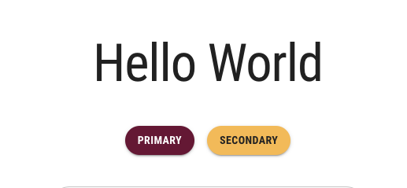

# Localization

According the [World Wide Web Consortium(W3C)](https://www.w3.org/International/questions/qa-i18n), localization refers to the adaptation of a product, application or document content to meet **language**, cultural and other requirements of a specific target market (or i.e. "locale"). In Canada, English and French are the two official languages at the federal level. While there may not be a strict legal requirement to have a French version of your website across all of Canada, it helps you connect with a broader audience, enhances the user experience, and demonstrates cultural sensitivity. These factors can collectively improve accessibility and make your website more welcoming and relevant to Canadians who prefer or require content in French. In this section, we will learn how to localize the application for French-speaking Canadian.  

## Install `next-intl`

Next.js has built-in support for internationalized [(i18n)](https://en.wikipedia.org/wiki/Internationalization_and_localization#Naming) routing. However, it currently only supports when your application's pages and components are rendered from the server side. For applications that are rendered from client side, they will require support from other packages to localize the applications. In this learning module, we will be using a package called `next-intl`.  

To install `next-intl`, go to the root directory of your project and run the following command.  

```bash
npm install next-intl
```

### Server-side Rendering and Client-side Rendering

Server-side rendering (SSR) and client-side rendering (CSR) are two different approaches to rendering web content in a web application.  

In SSR, the web server generates the HTML content for a page and sends it to the client's browser as a complete, fully-rendered page. This means that the server processes and compiles the content before it is sent to the client, which results in faster initial page loads because the client receives a fully-rendered page from the server. This is especially beneficial for search engine optimization (SEO) because search engine crawlers can easily parse the page content.  

In CSR, the initial HTML is often minimal, and the client's browser is responsible for rendering the page content. The browser loads the necessary JavaScript, which then fetches data and builds the page on the client-side. CSR can result in slower initial page loads because the client has to make additional requests for data and execute JavaScript code to render the page. This can lead to a "flash of empty content" as the page loads.  

So how does localization works in both server-side rendering and client-side rendering pages? In SSR, the localized text strings will be localized and embedded in the HTML contents before sending it back to the client's browser. While in CSR, the localization methods will be embedded in the JavaScript logic of the application and client's browser will request the localized text strings once it received the basic HTML and JavaScript contents.  

## Create Locale Routing Middleware

To localize your application with `next-intl`, we will need to create a routing middleware that helps to handle all the pages' redirects and rewrites based on the locale the user select manually or by default.  

Create a `[locale]` directory in the `app` directory. Then create the `layout.tsx` and `template.tsx` in the `[locale]` directory and move all your `page.tsx` files in there.  

Next, create a `middleware.ts` file in the root directory of your project and add the following lines of code to it:  

```ts
import createMiddleware from 'next-intl/middleware';

export default createMiddleware({
    // A list of all locales that are supported
    locales: ['en-CA', 'fr-CA'],

    // If this locale is matched, pathnames work without a prefix (e.g. `/about`)
    defaultLocale: 'en-CA'
});

export const config = {
    // Skip all paths that should not be internationalized. This example skips
    // certain folders and all pathnames with a dot (e.g. favicon.ico)
    matcher: ['/((?!api|_next|_vercel|.*\\..*).*)']
};
```

Here, we create a routing middleware, which handles redirects and rewrites based on the detected user locale.  And since all the pages are nested within the `[locale]` folder, all routes are prefixed with one of the supported locales declared above, `en-CA` and `fr-CA`.  

Now when you enter the website using URL [`localhost:3000/en-CA`](localhost:3000/en-CA), it will direct you the English version of the site, and to the French version one if you enter [`localhost:3000/fr-CA`](localhost:3000/fr-CA). And if you do not include a locale in the URL, i.e. [`localhost:3000`](localhost:3000), it will direct you to the English version by default as declared in the `defaultLocale` attribute above.  

## Modify `template.tsx` and `layout.tsx`

We will need to use `NextIntlClientProvider` to wrap the entire application so the localization would be applied to all the pages and components.  

Open `app/template.tsx` and edit its contents to the following:  

```ts
'use client';
import React from 'react'
import Head from 'next/head'
import CssBaseline from '@mui/material/CssBaseline'

export default function Template({children}: {children?: React.ReactNode}) {
    return (
        <>
            <Head>
                <title>McMaster Branding</title>
                <meta name="description" content="Generated by create next app" />
                <meta name="viewport" content="width=device-width, initial-scale=1" />
                <link rel="icon" href="/favicon.ico" />
            </Head>
            <CssBaseline />
            {children}
        </>
    )
}
```

Open `app/[locale]/template.tsx` and add the following lines of code:  

```ts
'use client';
import React from 'react'
import Navbar from "@/components/Navbar/Navbar";
import Footer from "@/components/Footer/Footer";

export default function Template({children}: {children?: React.ReactNode} ) {
    return (
        <>
            <Navbar />
            {children}
            <Footer />
        </>
    )
}
```

These steps allow contents in the `Navbar` and `Footer` components to be localized later.  

Next, open `app/[locale]/layout.tsx` and add the following lines of code:  

```ts
import {NextIntlClientProvider} from 'next-intl';
import {notFound} from 'next/navigation';

export function generateStaticParams() {
    return [{locale: 'en-CA'}, {locale: 'fr-CA'}];
}

export default async function LocalizationLayout({
   children,
   params
}: {
    children: React.ReactNode,
    params: {locale: string}
}) {
    let dict
    try {
        dict = (await import(`../../dictionaries/${params.locale}.json`)).default;
    } catch (error) {
        notFound();
    }

    return (
        <NextIntlClientProvider locale={params.locale} messages={dict}>
            {children}
        </NextIntlClientProvider>
    )
}
```

Here, we utilize the `NextIntlClientProvider` hook from `next-intl` to load dictionaries (`../../dictionaries/${params.locale}.json`) and send to all templates and pages within the `app/[locale]` directory.  

## Create Dictionaries

A dictionary of a language contains all the text strings used in the website with standard labels for them. `next-intl` will later read the text string from the corresponding dictionary using the label.  

We will create a `dictionaries` directory in the root directory of the project and add two new files in it, `en-CA.json` and `fr-CA.json`.  

We will localize the "Hello World" string in the landing page as an example and you can then apply the same techniques to the rest of the text strings in your application.  

And the following contents to `en-CA.json` and `fr-CA.json` respectively.  

`en-CA.json`,  
```json
{
    "index": {
        "title": "Hello World"
    }
}
```

`fr-CA.json`,  
```json
{
    "index": {
        "title": "Bonjour le monde"
    }
}
```

## Use Translation

Open `app/[locale]/page.tsx` and add the following import statements:  

```ts
import {useTranslations} from 'next-intl';
```

Next, we will need to use the `useTranslations` hook to read the `index` section from the corresponding JSON directionary.  

Add the following lines of code at the top of the `Page` function:  

```ts
const localized = useTranslations('index');
```

Replace the line with the "Hello World" text to the following:  

```tsx
// old
<Typography variant="h1">Hello World!</Typography>

// new
<Typography variant="h1">{localized('title')}!</Typography>
```

Now if you visit [`localhost:3000/fr-CA`](localhost:3000/fr-CA), you should see the "Hello World" text is successfully translated to French, "Bonjour le monde".  


And if you visit [`localhost:3000/en-CA`](localhost:3000/en-CA), you should see the "Hello World" English text.  


