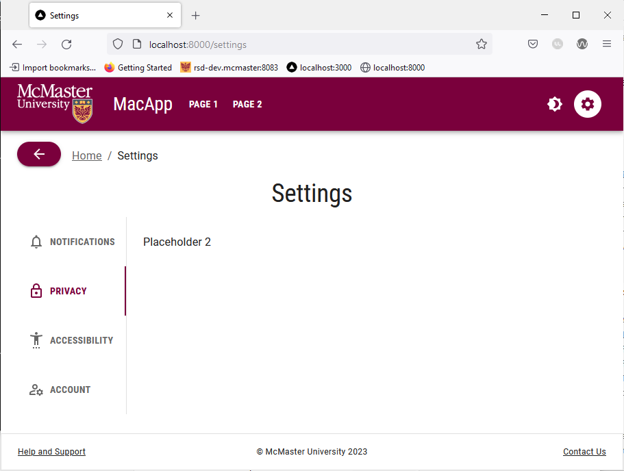

# Breadcrumbs With a Universal Back Button

Modern websites consist of multiple linked pages that create a hierarchical structure. Allowing the user to easily understand their current location on your website and giving them an easy way to navigate back to previous pages is imperative to providing an intuitive and responsive browsing experience. Breadcrumbs are a list of links that help the user visualize a page's location within the hierarchical structure of a website, in addition to enabling navigation to previously visited pages. Complementing breadcrumbs with a universal back button helps the user easily go back to the previous page they were on and decreases their reliance on the browser back button (whose behavior can be unpredictable at times). In this section, we will learn how to implement and style breadcrumbs and a universal back button in MUI.

### Create a Stylized `MacButton` Component
We will start by creating a stylized `MacButton` component based on the standard `MuiButton` button. We will add a `mainColor` prop to the `MacButton` component that will determine the background color, text color and hover color of the button. If the `mainColor` prop is `'primary'`, then the background color will be Heritage Maroon, the text color will be white and the button will turn a medium shade of grey when the user hovers over it as required by the McMaster Digital Brand Standards guide. On the other hand, if the `mainColor` prop is `'secondary'`, then the background color will be Heritage Gold, the text color will be dark grey and the button will turn light grey when the user hovers the mouse over it.

Create a `MacButton.tsx` file in the `components/MacComponents` directory and the following lines of code to it:
```
import {useTheme} from '@mui/material/styles'
import styled from '@emotion/styled'
import MuiButton, {ButtonProps} from '@mui/material/Button'

interface MacButtonProps extends ButtonProps {
    mainColor: string
}

export const MacButton = styled(MuiButton, {shouldForwardProp: (prop) => prop !== "mainColor"})<MacButtonProps>(props => ({
    backgroundColor: props.mainColor === 'secondary' ? useTheme().palette.secondary.main:  useTheme().palette.primary.main,
    color: props.mainColor === 'secondary' ? '#262626':  '',
    ':hover': {
        backgroundColor: props.mainColor === 'secondary' ? '#DBDBDD':'#5E6A71',
    },
}));
```
We will use the `primary` form of the `MacButton` component when implementing the universal back button that accompanies the breadcrumbs.

### Create the `Breadcrumbs` Component
In your `components` directory, create a `BreadCrumbs` subdirectory with a  `BreadCrumbs.tsx` file in it. Add the following lines of code to `BreadCrumbs.tsx`:
```
import Typography from '@mui/material/Typography'
import Breadcrumbs from '@mui/material/Breadcrumbs'
import {LinkProps} from '@mui/material/Link'
import Link from 'next/link'
import {useRouter} from 'next/router'
import React from 'react'
import Box from '@mui/material/Box'
import ArrowBackIcon from '@mui/icons-material/ArrowBack'
import Stack from '@mui/material/Stack'
import {MacButton} from '@/components/MacComponents/MacButton'

const breadcrumbNameMap: {[key: string]: string} = {
    '/page_1': 'Page 1',
    '/page_2': 'Page 2',
    '/settings': 'Settings',
    '/support': 'Help and Support',
}

interface LinkRouterProps extends LinkProps {
    href: string
    replace?: boolean
}

function LinkRouter(props: LinkRouterProps) {
    return <Typography {...props} component={Link}></Typography>
}

export default function BreadCrumbs() {
    const router = useRouter()

    const pathnames = router.pathname.split('/').filter(x => x)

    return (
        <Box sx={{paddingBottom: 2}}>
            <Stack direction="row" spacing={2}>
                <MacButton variant="contained" mainColor="primary" onClick={() => router.back()}>
                    <ArrowBackIcon />
                </MacButton>
                <Breadcrumbs sx={{paddingTop: 1}} aria-label="breadcrumb">
                    <LinkRouter underline="hover" color="inherit" href="/">
                        Home
                    </LinkRouter>
                    {pathnames.map((value, index) => {
                        const last = index === pathnames.length - 1
                        const to = `/${pathnames.slice(0, index + 1).join('/')}`

                        return last ? (
                            <Typography color="text.primary" key={to}>
                                {breadcrumbNameMap[to]}
                            </Typography>
                        ) : (
                            <LinkRouter
                                underline="hover"
                                color="inherit"
                                href={to}
                                key={to}
                            >
                                {breadcrumbNameMap[to]}
                            </LinkRouter>
                        )
                    })}
                </Breadcrumbs>
            </Stack>
        </Box>
    )
}
```

The `breadcrumbNameMap` maps the subdirectory of each page to the corresponding string that should appear in the breadcrumbs list. As you add more pages to your website, you will need to update this map to ensure that each page subdirectory is mapped to an appropriate name. The `LinkRouter` returns a `Link` component wrapped in a `Typography` component, i.e., a stylized string that redirects the user to a page when clicked.

The `BreadCrumbs` function returns a `Box` component containing a horizontal `Stack` consisting of the back button (`MacButton` containing an `ArrowBackIcon`) and the list of `Breadcrumbs`. We use the `back()` method of the `next/router` when defining the `OnClick` behavior of the `MacButton`, which allows us to return the user to the previous page. The last element of the breadcrumbs list is the page that the user is currently on, and as such we use a simple `Typography` component for it (i.e., it should not be clickable), whereas the other elements in the breadcrumbs list are `LinkRounter` components  (i.e., they should be clickable links that redirect the user to a particular page). Notice that we use the `slice` method, which returns a shallow copy of a portion of the `pathnames` array (end element not included) and `join` them with a `/` to build the URL that each breadcrumb points to. 

### Add `BreadCrumbs` to Pages
Now that our `BreadCrumbs` component is ready, we will import and use on all pages that require breadcrumbs. The `pages/index.tsx` is our homepage, and as such should not contain breadcrumbs. We will add the `BreadCrumbs` component to "Page 1", "Page 2", the "Help and Support" page and the "Settings" page.

Add the following import statement to `pages/page_1/index.tsx`:
```
import BreadCrumbs from "@/components/BreadCrumbs/BreadCrumbs";
```

Add `<BreadCrumbs />` right under the `<Container>` opening tag. Your  `pages/page_1/index.tsx` should now contain the following code:
```
import styles from '@/styles/Home.module.css'
import Typography from '@mui/material/Typography'
import {useEffect} from "react";
import Container from "@mui/material/Container";
import Box from "@mui/material/Box";
import BreadCrumbs from "@/components/BreadCrumbs/BreadCrumbs";

export default function Home() {
    useEffect(() => {
        document.title = 'Page 1'
    }, [])

  return (
    <>
      <main className={styles.page}>
          <Container>
              <BreadCrumbs />
              <Box
                  display="flex"
                  justifyContent="center"
                  alignItems="center">
                  <Typography variant="h1">Page 1</Typography>
              </Box>
          </Container>
      </main>
    </>
  )
}
```

Repeat this process for  `pages/page_2/index.tsx`, `pages/support/index.tsx` and `pages/settings/index.tsx`.

Open `localhost:3000` in your browser and navigate to "Page 1". You will see that the top left corner of the page has a breadcrumbs list along with a back button. Click the "Home" link will take you back to the homepage.


Go back to "Page 1", then navigate to the "Settings" page. Try hovering over the back button and notice how it turns grey. Clicking the back button will take you back to "Page 1".

