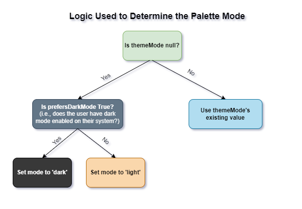
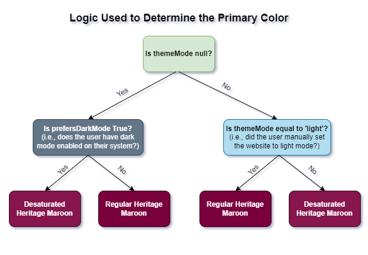
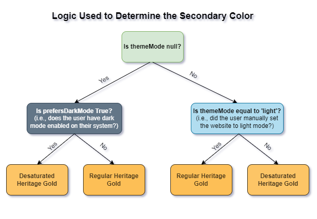
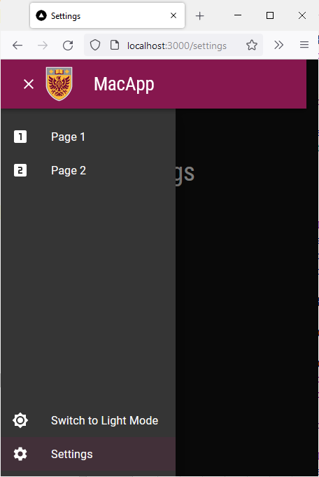

# Dark and Light Mode

A responsive website should follow the theme preference set by the user on their operating system (OS) or web browser. Material UI allows us to switch between light and dark themes based on user preference by using the `ThemeProvider` component and a toggle switch. In this section, we will add a light/dark mode toggle to our navigation bar and we will learn how to leverage the `useMediaQuery` hook and the `prefers-color-scheme` media query to enable dark mode automatically by checking the user's preference in their OS or browser settings.

### Modify `theme.ts`
We had previously set the primary and secondary colors of our theme in the `config/theme.ts` file. However, when using dark mode in our website, we will need to desaturate these colors to maintain a satisfactory level of contrast between the elements on screen and improve readability. Therefore, we will need to remove the primary and secondary color definitions from `theme.ts` since these values will now be set programmatically depending on the theme mode used.

**Delete** the following lines from `theme.ts`:
```
palette: {
    primary: {
        main: "#7a003c"
    },
    secondary: {
        main: "#fdbf57"
    }
},
```


### Modify `_app.tsx`
Open `pages/_app.tsx` and add the following import statements:
```
import React from 'react'
import useMediaQuery from '@mui/material/useMediaQuery'
```

Create and export the `ColorModeContext` constant, which will allow us to read and modify the theme mode of our website from the navigation bar. The following code should be added before the `App` function declaration:
```
export const ColorModeContext = React.createContext({
    toggleColorMode: () => {},
})
```

Next, we will read the value of the media `prefers-color-scheme` query and save it as a Boolean constant whose value is true if the user currently has dark mode enabled on their system. We will also use the React state hook to create a `mode` constant with a `null` initial value and a `setColor` function that is used to update the `mode` constant.

Add the following lines of the code at the top of the `App` function:
```
const prefersDarkMode = useMediaQuery('(prefers-color-scheme: dark)')

const [mode, setMode] = React.useState<'light' | 'dark' | null>(null)
```

Replace the `const theme` declaration with the following updated declaration:
```
const theme = React.useMemo(
    () =>
        createTheme({
            ...themeOptions,
            palette: {
                mode:
                    mode == null
                        ? prefersDarkMode
                            ? 'dark'
                            : 'light'
                        : mode,
                primary: {
                    main:
                        mode == null
                            ? prefersDarkMode
                                ? '#86174E'
                                : '#7a003c'
                            : mode == 'light'
                                ? '#7a003c'
                                : '#86174E',
                },
                secondary: {
                    main:
                        mode == null
                            ? prefersDarkMode
                                ? '#FDC566'
                                : '#fdbf57'
                            : mode == 'light'
                                ? '#fdbf57'
                                : '#FDC566',
                },
            },
        }),
    [mode, prefersDarkMode]
);
```
This updated declaration utilizes the React `useMemo` hook to create and cache a theme value. The value of the `mode` attribute is determined by examining the the value of the `themeMode` constant we created earlier. The diagram below explains the conditional logic used to determine the value of `mode`:

When using dark mode, the primary and secondary colors of our theme are desaturated to retain readability and enhance contrast. The values of these colors are now determined programmatically as shown in the diagrams below:



We will now make use of the React `useMemo` hook to calculate and cache the value of the `colorMode` constant. Add the following lines of code **after** the `theme` declaration:
```
 const colorMode = React.useMemo(
        () => ({
            toggleColorMode: () => {
                setThemeMode(prevMode => (prevMode == null ? (theme.palette.mode === 'dark' ? 'light' : 'dark') : prevMode === 'light' ? 'dark' : 'light'))
            },
        }),
        [theme]
    )
```

Finally, wrap the returned elements of the `App` function with the `ColorModeContext.Provider`:
```
return <>
        <ColorModeContext.Provider value={colorMode}>
            <ThemeProvider theme={theme}>
              <Navbar />
              <CssBaseline />
              <Component {...pageProps} />
          </ThemeProvider>
        </ColorModeContext.Provider>
    </>
```
Your `_app.tsx` file should now look like this:
```
import React from 'react'
import type { AppProps } from 'next/app'
import CssBaseline from '@mui/material/CssBaseline'
import {createTheme, ThemeProvider, useTheme} from '@mui/material/styles'
import themeOptions from '@/config/theme'
import Navbar from "@/components/Navbar/Navbar";
import useMediaQuery from '@mui/material/useMediaQuery'

export const ColorModeContext = React.createContext({
    toggleColorMode: () => {},
})

export default function App({ Component, pageProps }: AppProps) {
    const prefersDarkMode = useMediaQuery('(prefers-color-scheme: dark)')

    const [themeMode, setThemeMode] = React.useState<'light' | 'dark' | null>(null)

    const theme = React.useMemo(
        () =>
            createTheme({
                ...themeOptions,
                palette: {
                    mode:
                        themeMode == null
                            ? prefersDarkMode
                                ? 'dark'
                                : 'light'
                            : themeMode,
                    primary: {
                        main:
                            themeMode == null
                                ? prefersDarkMode
                                    ? '#86174E'
                                    : '#7a003c'
                                : themeMode == 'light'
                                    ? '#7a003c'
                                    : '#86174E',
                    },
                    secondary: {
                        main:
                            themeMode == null
                                ? prefersDarkMode
                                    ? '#FDC566'
                                    : '#fdbf57'
                                : themeMode == 'light'
                                    ? '#fdbf57'
                                    : '#FDC566',
                    },
                },
            }),
        [themeMode, prefersDarkMode]
    )

    const colorMode = React.useMemo(
        () => ({
            toggleColorMode: () => {
                setThemeMode(prevMode => (prevMode == null ? (theme.palette.mode === 'dark' ? 'light' : 'dark') : prevMode === 'light' ? 'dark' : 'light'))
            },
        }),
        [theme]
    )

    return <>
        <ColorModeContext.Provider value={colorMode}>
            <ThemeProvider theme={theme}>
              <Navbar />
              <CssBaseline />
              <Component {...pageProps} />
          </ThemeProvider>
        </ColorModeContext.Provider>
    </>
}
```

### Add Light/Dark Mode Toggle to Navigation Bar
We will now add a responsive toggle to our navigation bar that allows the user to easily switch between dark and light mode. 
Start by adding the following import statement to `Navbar.tsx`:
```
import {useTheme} from '@mui/material/styles'
import Brightness4Icon from '@mui/icons-material/Brightness4'
import Brightness7Icon from '@mui/icons-material/Brightness7'
import {ColorModeContext} from '@/pages/_app'
```

Next, we will use the `useTheme` hook to access the theme variables in `Navbar.tsx` in addition to the `useContext` hook to grab the current context value of the `ColorModeContext` imported from `pages/_app.tsx`.

Add the following two lines to the top of the `Navbar` function:
```
const theme = useTheme()
const colorMode = React.useContext(ColorModeContext)
```

We will now add the toggle button to the navigation bar. Add the following lines of code before the `Box` containing the settings icon:
```
<Box sx={{paddingRight: 1, display: {xs: 'none', md: 'flex'}}}>
    <Tooltip
        title={
            theme.palette.mode === 'dark'
                ? 'Switch to Light Mode'
                : 'Switch to Dark Mode'
        }
    >
        <MacIconNavButton
            sx={{ml: 1}}
            onClick={colorMode.toggleColorMode}
            color="inherit"
        >
            {theme.palette.mode === 'dark' ? (
                <Brightness7Icon />
            ) : (
                <Brightness4Icon />
            )}
        </MacIconNavButton>
    </Tooltip>
</Box>
```
We are a use the custom `MacIconNavButton` component that we created earlier and the MUI `Tooltip` component. Notice that the icon and the tooltip message displayed change according to the value of the current theme.

We will now update the `pages_drawer` function to display the dark/light mode toggle in the app drawer. Add the following lines of code to the `pages_drawer` function at the top of the second `List` component:
```
<ListItem key={'mode'} disablePadding>
	<ListItemButton onClick={colorMode.toggleColorMode}
					color="inherit" >
		<ListItemIcon>
			{theme.palette.mode === 'dark' ? (
				<Brightness7Icon />
			) : (
				<Brightness4Icon />
			)}
		</ListItemIcon>
		<ListItemText primary={theme.palette.mode === 'dark'
			? 'Switch to Light Mode'
			: 'Switch to Dark Mode'} />
	</ListItemButton>
</ListItem>
```

Your `Navbar.tsx` file should now look like this:
```

import * as React from 'react'
import AppBar from '@mui/material/AppBar'
import Box from '@mui/material/Box'
import Toolbar from '@mui/material/Toolbar'
import Typography from '@mui/material/Typography'
import MenuIcon from '@mui/icons-material/Menu'
import Container from '@mui/material/Container'
import Link from 'next/link'
import {useRouter} from 'next/router'
import styles from '@/styles/NavBar.module.css'
import {MacIconNavButton, MacNavButton,} from '@/components/MacComponents/MacNavButton'
import Tooltip from '@mui/material/Tooltip'
import Drawer from "@mui/material/Drawer";
import List from "@mui/material/List";
import ClearIcon from '@mui/icons-material/Clear';
import ListItem from "@mui/material/ListItem";
import ListItemButton from "@mui/material/ListItemButton";
import ListItemIcon from "@mui/material/ListItemIcon";
import ListItemText from "@mui/material/ListItemText";
import LooksOneIcon from '@mui/icons-material/LooksOne';
import LooksTwoIcon from '@mui/icons-material/LooksTwo';
import SettingsIcon from '@mui/icons-material/Settings'
import {useTheme} from '@mui/material/styles'
import Brightness4Icon from '@mui/icons-material/Brightness4'
import Brightness7Icon from '@mui/icons-material/Brightness7'
import {ColorModeContext} from '@/pages/_app'

const pages = [
    ['Page 1', '/page_1'],
    ['Page 2', '/page_2'],
]

export default function Navbar() {
    const theme = useTheme()
    const colorMode = React.useContext(ColorModeContext)

    const imgStyle = {
        paddingTop: '10px',
        paddingBottom: '10px',
        paddingRight: '30px',
    }

    const [state, setState] = React.useState(false);

    const toggleDrawer =
        (open: boolean) =>
            (event: React.KeyboardEvent | React.MouseEvent) => {
                if (
                    event.type === 'keydown' &&
                    ((event as React.KeyboardEvent).key === 'Tab' ||
                        (event as React.KeyboardEvent).key === 'Shift')
                ) {
                    return;
                }
                setState(open);
            };

    const router = useRouter()
    const currentRoute = router.pathname

    const icons = [<LooksOneIcon key={'transcripts-page'} />, <LooksTwoIcon key={'privacy-policy'}/>]

    const pages_drawer = () => (
        <Box
            paddingTop={1}
            sx={{ width:  250 }}
            role="presentation"
            onKeyDown={toggleDrawer(false)}
        >
            <List>
                {pages.map((page, index) => (
                    <ListItem key={page[0]} disablePadding>
                        <ListItemButton onClick={toggleDrawer(false)} component={Link} href={page[1]} selected= {currentRoute === page[1]} >
                            <ListItemIcon>
                                {icons[index]}
                            </ListItemIcon>
                            <ListItemText primary={page[0]} />
                        </ListItemButton>
                    </ListItem>
                ))}
            </List>
            <List style={{ position: "absolute", bottom: "0", right: "0", left: "0"}}>
                <ListItem key={'mode'} disablePadding>
                    <ListItemButton onClick={colorMode.toggleColorMode}
                                    color="inherit" >
                        <ListItemIcon>
                            {theme.palette.mode === 'dark' ? (
                                <Brightness7Icon />
                            ) : (
                                <Brightness4Icon />
                            )}
                        </ListItemIcon>
                        <ListItemText primary={theme.palette.mode === 'dark'
                            ? 'Switch to Light Mode'
                            : 'Switch to Dark Mode'} />
                    </ListItemButton>
                </ListItem>
                <ListItem key={'settings'} disablePadding>
                    <ListItemButton onClick={toggleDrawer(false)} component={Link} href={'/settings'} selected= {currentRoute === '/settings'} color="inherit" >
                        <ListItemIcon>
                            <SettingsIcon />
                        </ListItemIcon>
                        <ListItemText primary={'Settings'} />
                    </ListItemButton>
                </ListItem>
            </List>
        </Box>
    );

    return (
        <AppBar
            position="relative"
            enableColorOnDark
            style={{backgroundImage: 'none'}}
            sx={{zIndex: theme => theme.zIndex.drawer + 1, borderRadius: 0}}
        >
            <Container maxWidth="xl">
                <Toolbar disableGutters>
                    <Box sx={{flexGrow: 1, display: {xs: 'flex', md: 'none'}}}>
                        <Tooltip enterDelay={500} title={state ? "Close App Drawer" : "Open App Drawer"}>
                            <MacIconNavButton
                                size="large"
                                aria-controls="menu-appbar"
                                aria-haspopup="true"
                                onClick={toggleDrawer(!state)}
                                color="inherit"
                            >
                                {state ? <ClearIcon /> : <MenuIcon />}
                            </MacIconNavButton>
                        </Tooltip>
                        <Drawer
                            anchor={"left"}
                            open={state}
                            onClose={toggleDrawer(false)}
                            sx={{
                                '& .MuiDrawer-root': {
                                    position: 'absolute'
                                },
                                '& .MuiPaper-root': {
                                    position: 'absolute',
                                    borderRadius: 0
                                },
                                minWidth: 100,
                                width: "20%",
                                position: "absolute",
                                top: '70px',
                                display: {xs: 'flex', md: 'none'}
                            }}
                        >
                            {pages_drawer()}
                        </Drawer>
                        <Box
                            justifyContent="center"
                            alignItems="center"
                            sx={{alignItems: 'center', display: {xs: 'flex', md: 'none'}}}
                        >
                            <Box
                                component="img"
                                sx={{
                                    height: 70,
                                    width: '100%',
                                }}
                                alt="McMaster Logo"
                                src="/assets/logo-small.png"
                                style={imgStyle}
                            />
                            <Typography
                                variant="h3"
                                component={Link}
                                href="/"
                                sx={{
                                    mr: 2,
                                    flexGrow: 1,
                                    color: 'inherit',
                                    textDecoration: 'none',
                                }}
                                className={styles.title}
                            >
                                MacApp
                            </Typography>
                        </Box>
                    </Box>
                    <Box
                        component="img"
                        sx={{
                            height: 78.31,
                            width: 140,
                            display: {xs: 'none', md: 'flex'}
                        }}
                        alt="McMaster Logo"
                        src="/assets/logo.png"
                        style={imgStyle}
                    />
                    <Typography
                        variant="h3"
                        noWrap
                        component={Link}
                        href="/"
                        sx={{
                            mr: 2,
                            display: {xs: 'none', md: 'flex'},
                            textDecoration: 'none',
                            color: 'inherit',
                        }}
                        className={styles.title}
                    >
                        MacScribe
                    </Typography>
                    <Box sx={{flexGrow: 1, display: {xs: 'none', md: 'flex'}}}>
                        {pages.map(page => (
                            <MacNavButton
                                key={page[0]}
                                component={Link}
                                href={page[1]}
                                className={
                                    currentRoute === page[1]
                                        ? styles.active
                                        : styles.nonActive
                                }
                                sx={{my: 2, color: 'white', display: 'block'}}
                            >
                                {page[0]}
                            </MacNavButton>
                        ))}
                    </Box>
                    <Box sx={{paddingRight: 1, display: {xs: 'none', md: 'flex'}}}>
                        <Tooltip
                            title={
                                theme.palette.mode === 'dark'
                                    ? 'Switch to Light Mode'
                                    : 'Switch to Dark Mode'
                            }
                        >
                            <MacIconNavButton
                                sx={{ml: 1}}
                                onClick={colorMode.toggleColorMode}
                                color="inherit"
                            >
                                {theme.palette.mode === 'dark' ? (
                                    <Brightness7Icon />
                                ) : (
                                    <Brightness4Icon />
                                )}
                            </MacIconNavButton>
                        </Tooltip>
                    </Box>
                    <Box sx={{paddingRight: 1, display: {xs: 'none', md: 'flex'}}}>
                        <Tooltip title="Settings">
                            <MacIconNavButton
                                aria-label="settings"
                                color="inherit"
                                component={Link}
                                className={
                                    currentRoute === '/settings'
                                        ? styles.active
                                        : styles.nonActive
                                }
                                href="/settings"
                            >
                                <SettingsIcon />
                            </MacIconNavButton>
                        </Tooltip>
                    </Box>
                </Toolbar>
            </Container>
        </AppBar>
    );
}

```

Go back to your browser and try switching mode by using the sundial icon in the navigation bar.


The chosen mode is automatically applied to all pages of the website. Try navigating to "Page1", "Page 1" and the "Settings" page. They will all automatically use the chosen mode and the text and UI element colors will change to maintain readability.

Try enabling dark mode on your system and then navigate to the website in a new tab or reload the current tab. The website should automatically use dark mode when you first load the page. Note that you can still manually switch to light mode using the sundial icon.

On small screen devices, the dark/light mode toggle can be found in the app drawer:
