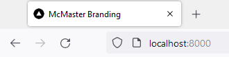
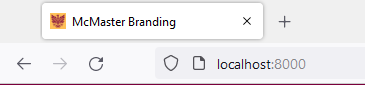

# Update the Favicon

Changing the default favicon of a Next.js application is one of the first things you can do when branding your website.

Download the McMaster favicon from the [McMaster University Brand Standards Website Favicon Folder](https://brand-resources.mcmaster.ca/asset-bank/action/browseItems?categoryId=1516&categoryTypeId=2&cachedCriteria=1).

The favicon is set in the `pages/index.tsx` file as shown in the following code snippet.

```
<Head>
	<title>McMaster Branding</title>
	<meta name="description" content="Generated by create next app" />
	<meta name="viewport" content="width=device-width, initial-scale=1" />
	<link rel="icon" href="/favicon.ico" />
</Head>
```

To change the favicon of your SPA, delete the `public/favicon.ico` file and replace it with the McMaster `favicon.ico` file. Make the sure the name of the downloaded favicon is `favicon.ico`.

Default Favicon          |  McMaster Favicon
:-------------------------:|:-------------------------:
  |  

Note that your browser may have already cached the favicon, so may need to clear the browser data to force the browser to load the new icon.