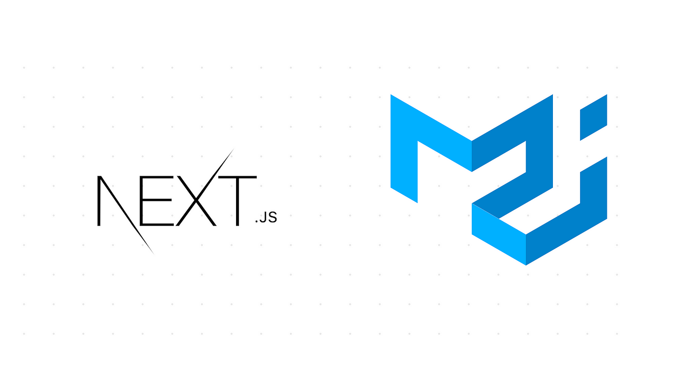
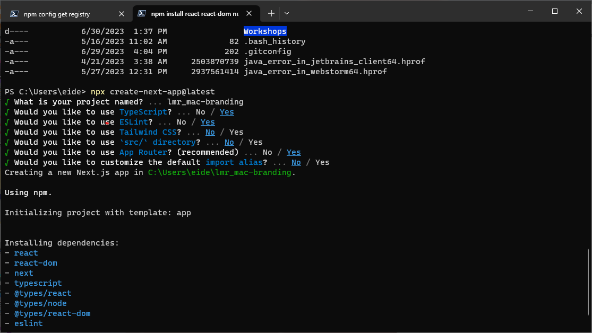
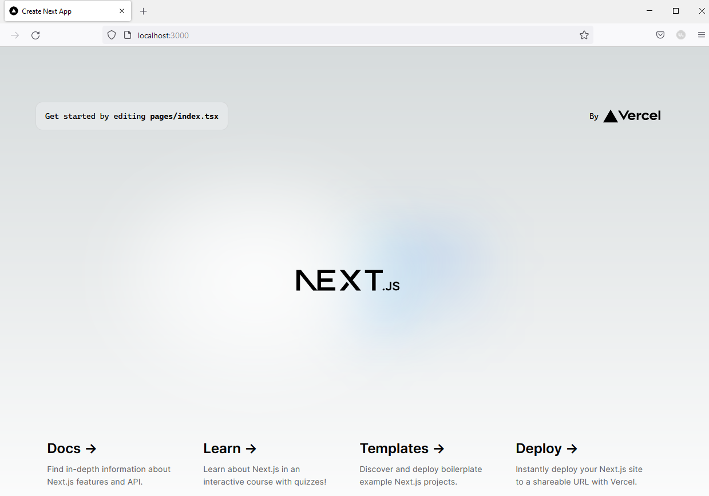

# Building Modern Single-Page Applications


_Image retrieved from [tillerdigital.com]([7 challenges in web application design and development | Tiller Digital](https://tillerdigital.com/blog/7-challenges-in-web-application-development/))_

# Introduction to Material UI (MUI)

_Image retrieved from [itnext.io](https://itnext.io/next-js-with-material-ui-7a7f6485f671)_


In this learning module, we will take a deep dive into the process of designing and building responsive single-page applications from scratch. We will explore the different ways you can style your web applications to adhere to a consistent theme that is reflected throughout the user interface. We will add support for light and dark mode in our web application to give users the flexibility of choosing the viewing experience that best suits their preferences and light conditions. We will learn how to style visual components and modify their behavior to ensure that they react to the user’s actions in an intuitive matter. We will also explore the various design patterns that you can adopt to ensure that your web application scales appropriately on mobile devices with small screens without any loss of functionality. Finally, we will learn how to evaluate a web page to ensure that it meets the standards required by the Accessibility for Ontarians with Disabilities Act (AODA).

This workshop uses the Next.js framework in conjunction with the Material UI (MUI) library. If you are using a different tech stack or framework that the ones in this workshop, please feel free to book a consultation with the Research Software Development team by emailing [rsd@mcmaster.ca](mailto:rsd@mcmaster.ca). No previous experience with Next.js or MUI is required. Familiarity with TypeScript and React will be helpful but is not necessary.

## Prerequisites
- **Git**: Git should be installed on your local machine to clone the workshop web application repository. Please consult the following [guide](https://github.com/git-guides/install-git) if you need help installing git on your machine.
- **IDE (Integrated Development Environment)**: You will need to have an IDE installed on your computer to easily modify the workshop web application files. We recommend using [Visual Studio Code](https://code.visualstudio.com/) or [WebStorm](https://www.jetbrains.com/webstorm/).
- **Node.js**: We will be using Node.js in this workshop. Please consult the [Pre-module Material](pre-module.md) section if you need help installing Node.js on your machine.

## Initial Setup

Please follow these steps to install Node.js and create a Next.js application **before** starting the learning module.

If you are using Windows or MacOS, use one of the installers from the [Node.js download page](https://nodejs.org/en/download/). Be sure to install the version labeled **LTS**. Other versions have not yet been tested with `npm`.

If you are using a Linux distribution, you can install Node.js using the `apt` package manager.
1. Start by refreshing your local package index: 
~~~
sudo apt update
~~~
2. Install Node.js: 
~~~
sudo apt install nodejs
~~~
3. Verify that the installation was successful: 
~~~
node -v
~~~
  You should be presented with the version of Node.js that you just installed.
4. Install the `npm` package manager:
~~~
sudo apt install npm
~~~

### Create a Next.js Application
Once you have Node.js installed, you can create a template Next.js application using the following command:
```npx create-next-app```
You will need to pick a name for your application and specify a few preferences as shown below:


### Start the Development Server
`cd` into the your project directory: 
~~~
cd lmr_mac-branding
~~~
Start the development server:
~~~
npm run dev
~~~

### View Default Landing Page
Open your browser of choice and navigate to: `localhost:3000`
You should be presented with the following page:


### Modify `page.module.css`
Create a `styles` directory in the root directory of your project. Move the `page.module.css` file to the `styles` directory.
Open the `page.module.css` file located in the `app` directory and change the `min-height` value from `100vh` to `calc(100vh - 164px)`:
```
.main {
  display: flex;
  flex-direction: column;
  justify-content: space-between;
  align-items: center;
  padding: 6rem;
  min-height: calc(100vh - 164px);
  margin-top: auto;
}
```
This change will reduce the amount of whitespace on the main page.

Similarly, update the `import ./page.module.css` statement in `layout.tsx` as shown below:
```
import styles from '../styles/page.module.css'
```

### Modify `layout.tsx`
Using the text editor or IDE of your choice, modify the `app/layout.tsx` file located in the `app` directory by selecting and change the title of the application by modifying line 8.

Enter the new title as shown below:
```
export const metadata: Metadata = {
  title: 'McMaster Branding',
  description: 'Generated by create next app',
}
```

**Delete** the `import ./global.css` statement.

**Delete** the following lines as well:
```
import { Inter } from 'next/font/google'

const inter = Inter({ subsets: ['latin'] })
```

Update the `<body>` component as shown below:
```
<body>{children}</body>
```

Your `layout.tsx` file should now contain the following lines of code:
```
import type { Metadata } from 'next'

export const metadata: Metadata = {
  title: 'McMaster Branding',
  description: 'Generated by create next app',
}

export default function RootLayout({
  children,
}: {
  children: React.ReactNode
}) {
  return (
    <html lang="en">
      <body>{children}</body>
    </html>
  )
}
```

### Modify the Main Page
Open the `app/page.tsx` file and delete all the lines between the `<main className={styles.main}>` and the `</main>` closing tag. Delete the `Image` import statement `import Image from 'next/image'`.

Add the `use client` directive before the import statement:
```
'use client';
```

Add the following line of code inside the `main` component:  
`<h1> Hello World!</h1>`

Your `app/page.tsx` file should now look like this:
```
'use client';

import styles from '../styles/page.module.css'

export default function Page() {
  return (
    <main className={styles.main}>
      <h1> Hello World!</h1>
    </main>
  )
}
```

Go back to your browser tab, the page should now look like this:


### Add the Material UI Library to Your Application
Navigate to the your project's directory if you are not already in it: 
~~~
cd lmr_mac-branding
~~~

Run the following command to add the MUI library to your project using the `npm` package manager: 
~~~
npm install @mui/material @emotion/react @emotion/styled @mui/icons-material
~~~
You will be presented with the following message `added 59 packages, and audited 358 packages in 6s` if the installation is successful. Some of the numbers in the message may be different for you.