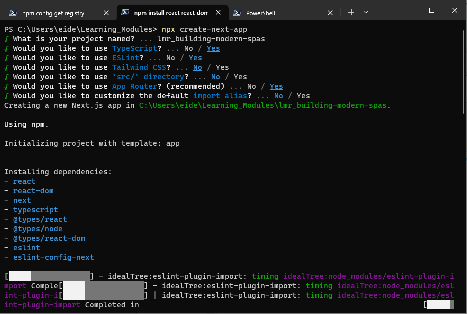

The [McMaster Digital Brand Standards](https://brand.mcmaster.ca/app/uploads/2019/04/digital-guidelines.pdf) PDF document provides a good overview of the brand guidelines designed to ensure recognition of the McMaster University brand and consistency of its message. The design guidelines presented in this learning module were pulled from this PDF document and modified to apply to Material UI (MUI) components.

This learning module uses the Next.js framework in conjunction with the Material UI (MUI) library. If you are using a different tech stack or framework that the ones in this learning module, please feel free to book a consultation with the Research Software Development team by emailing [rsd@mcmaster.ca](mailto:rsd@mcmaster.ca).

# Introduction to Material UI (MUI)

_Image retrieved from [itnext.io](https://itnext.io/next-js-with-material-ui-7a7f6485f671)_

Learn the basics of styling Material UI components to conform to the McMaster Digital Brand Standards. Material UI is a widely used open-source React component library that implements Google's [Material Design](https://m2.material.io/). The library includes an extensive collection of prebuilt components that are ready for use in production right out of the box. Material UI offers comprehensive styling tools that allow you to customize the design system of its components. Material UI allows you to build websites faster and enjoys a great deal of support in the React community given that it is the largest UI community in the React ecosystem. MUI also reduces the barrier to entry by providing an intuitive development experience for less technical designers and developers. The official MUI documentation includes code snippets for all its components to help developers use them effectively when creating their websites.

In this beginner learning module, participants will learn how to create a Next.js application, add the MUI library to it, and style MUI components to fit the McMaster Digital Brand Standards. We will also learn how to ensure that these components scale properly on small screen devices and how to evaluate a website for AODA compliance using the Wave tool. 
No previous experience with Next.js or MUI is required. Familiarity with TypeScript and React will be helpful but is not necessary.

## Initial Setup

Please follow these steps to install Node.js and create a Next.js application **before** starting the learning module.

If you are using Windows or MacOS, use one of the installers from the [Node.js download page](https://nodejs.org/en/download/). Be sure to install the version labeled **LTS**. Other versions have not yet been tested with `npm`.

If you are using a Linux distribution, you can install Node.js using the `apt` package manager.
1. Start by refreshing your local package index: 
~~~
sudo apt update
~~~
2. Install Node.js: 
~~~
sudo apt install nodejs
~~~
3. Verify that the installation was successful: 
~~~
node -v
~~~
  You should be presented with the version of Node.js that you just installed.
4. Install the `npm` package manager:
~~~
sudo apt install npm
~~~

### Create a Next.js Application
Once you have Node.js installed, you can create a template Next.js application using the following command:
```npx create-next-app```
You will need to pick a name for your application and specify a few preferences as shown below:


### Start the Development Server
`cd` into the your project directory: 
~~~
cd lmr_mac-branding
~~~
Start the development server:
~~~
npm run dev
~~~

### View Default Landing Page
Open your browser of choice and navigate to: `localhost:3000`
You should be presented with the following page:


### Modify `page.module.css`
Create a `styles` directory in the root directory of your project. Move the `page.module.css` file to the `styles` directory.
Open the `page.module.css` file located in the `app` directory and change the `min-height` value from `100vh` to `calc(100vh - 164px)`:
```
.main {
  display: flex;
  flex-direction: column;
  justify-content: space-between;
  align-items: center;
  padding: 6rem;
  min-height: calc(100vh - 164px);
  margin-top: auto;
}
```
This change will reduce the amount of whitespace on the main page.

Similarly, update the `import ./page.module.css` statement in `layout.tsx` as shown below:
```
import styles from '../styles/page.module.css'
```

### Modify `layout.tsx`
Using the text editor or IDE of your choice, modify the `app/layout.tsx` file located in the `app` directory by selecting and change the title of the application by modifying line 8.

Enter the new title as shown below:
```
export const metadata: Metadata = {
  title: 'McMaster Branding',
  description: 'Generated by create next app',
}
```

**Delete** the `import ./global.css` statement.

**Delete** the following lines as well:
```
import { Inter } from 'next/font/google'

const inter = Inter({ subsets: ['latin'] })
```

Update the `<body>` component as shown below:
```
<body>{children}</body>
```

Your `layout.tsx` file should now contain the following lines of code:
```
import type { Metadata } from 'next'

export const metadata: Metadata = {
  title: 'McMaster Branding',
  description: 'Generated by create next app',
}

export default function RootLayout({
  children,
}: {
  children: React.ReactNode
}) {
  return (
    <html lang="en">
      <body>{children}</body>
    </html>
  )
}
```

### Modify the Main Page
Open the `app/page.tsx` file and delete all the lines between the `<main className={styles.main}>` and the `</main>` closing tag. Delete the `Image` import statement `import Image from 'next/image'`.

Add the `use client` directive before the import statement:
```
'use client';
```

Add the following line of code inside the `main` component:  
`<h1> Hello World!</h1>`

Your `app/page.tsx` file should now look like this:
```
'use client';

import styles from '../styles/page.module.css'

export default function Page() {
  return (
    <main className={styles.main}>
      <h1> Hello World!</h1>
    </main>
  )
}
```

Go back to your browser tab, the page should now look like this:


### Add the Material UI Library to Your Application
Navigate to the your project's directory if you are not already in it: 
~~~
cd lmr_mac-branding
~~~

Run the following command to add the MUI library to your project using the `npm` package manager: 
~~~
npm install @mui/material @emotion/react @emotion/styled @mui/icons-material
~~~
You will be presented with the following message `added 59 packages, and audited 358 packages in 6s` if the installation is successful. Some of the numbers in the message may be different for you.