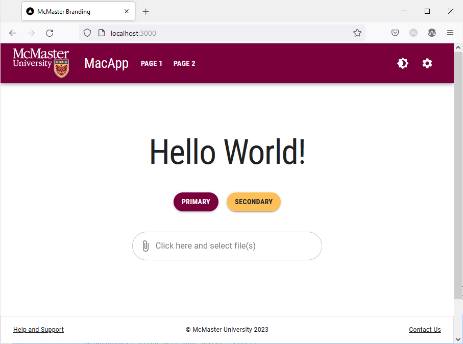

# Interative UI Elements

Modern websites requires the use of UI elements that not only allow the user to perform a wide range of functions, but also react to the user's actions in an intuitive manner. MUI offers a wide range of customizable built-in components that adhere to the Material Design Language. In this section, we will learn how to style certain MUI components to conform to the stylistic guidelines set by McMaster Digital Brand Standards Manual. The aim of this section is not to provide a comprehensive tutorial on how to use these different MUI components (this information is covered in the [Material UI Documentation](https://mui.com/material-ui/getting-started/overview/) ), but to modify the components' behavior and appearance to fit the McMaster Digital Brand Standards. 

### Buttons
We have already create a stylized `MuiButton` component called `MacButton` in the "Breadcrumbs With a Universal Back Button" section. We will now show a couple more examples of how we can use the stylized `MacButton` component in different ways.

Open the `pages/index.tsx` file and add the following import statements:
```
import React from "react";
import Stack from "@mui/material/Stack";  
import Snackbar from '@mui/material/Snackbar';  
import IconButton from '@mui/material/IconButton';  
import CloseIcon from '@mui/icons-material/Close';
```
Declare and export these two interfaces above the `Home` function:
```
export interface SnackbarMessage {
    message: string;
    key: number;
}

export interface State {
    open: boolean;
    snackPack: readonly SnackbarMessage[];
    messageInfo?: SnackbarMessage;
}

```
Add the following lines of code at the top of the `Home` function:
```
const [snackPack, setSnackPack] = React.useState<readonly SnackbarMessage[]>([]);
const [open, setOpen] = React.useState(false);
const [messageInfo, setMessageInfo] = React.useState<SnackbarMessage | undefined>(
    undefined,
);

React.useEffect(() => {
    if (snackPack.length && !messageInfo) {
        // Set a new snack when we don't have an active one
        setMessageInfo({ ...snackPack[0] });
        setSnackPack((prev) => prev.slice(1));
        setOpen(true);
    } else if (snackPack.length && messageInfo && open) {
        // Close an active snack when a new one is added
        setOpen(false);
    }
}, [snackPack, messageInfo, open]);

const handleClick = (message: string) => () => {
    setSnackPack((prev) => [...prev, { message, key: new Date().getTime() }]);
};

const handleClose = (event: React.SyntheticEvent | Event, reason?: string) => {
    if (reason === 'clickaway') {
        return;
    }
    setOpen(false);
};

const handleExited = () => {
    setMessageInfo(undefined);
};

const action = (
    <React.Fragment>
        <IconButton
            size="small"
            aria-label="close"
            color="inherit"
            onClick={handleClose}
        >
            <CloseIcon fontSize="small" />
        </IconButton>
    </React.Fragment>
);
```
This code snippet is used to handle opening and closing the popup message that will be shown when clicking the `MacButton` components that we will add shortly.

Delete the line containing the `Typography` component and replace it with the following lines of code:
```
<Snackbar
    sx={ {paddingTop: 10} }
    open={open}
    autoHideDuration={6000}
    onClose={handleClose}
    TransitionProps={ { onExited: handleExited } }
    message={messageInfo ? messageInfo.message : undefined}
    action={action}
    anchorOrigin={ {vertical: 'top', horizontal: 'right'} }
/>
<Stack
    direction="column"
    justifyContent="space-between"
    alignItems="center"
    spacing={5}
>
    <Typography variant="h1">Hello World!</Typography>
    <Stack
        direction="row"
        justifyContent="space-between"
        alignItems="center"
        spacing={2}
    >
        <MacButton variant="contained" mainColor="primary" onClick={handleClick('Primary Button Clicked!')}>Primary</MacButton>
        <MacButton variant="contained" mainColor="secondary" onClick={handleClick('Secondary Button Clicked!')}>Secondary</MacButton>
    </Stack>
</Stack>
```
We used the MUI `Stack` component to stack the "Hello World!" message vertically on top of another `Stack` containing two buttons in a row. The `Snackbar` component is used to display the popup message shown after clicking a button. The MUI guidelines recommend displaying only one `Snackbar` message at a time. Hence, if your application has multiple `Snackbar` messages, you should dismiss the current message before displaying the next one. You can find out more about the MUI `Snackbar` component by visiting the [Snackbar official documentation](https://mui.com/material-ui/react-snackbar/).

Notice that the `mainColor` on the first button is `"primary"`, whereas the second button uses the `"secondary"` color.

Go back to your browser, your homepage should now look like this:

Notice that the buttons are always rounded and not rectangular in shape as recommended by the McMaster Digital Brand Standards Manual. The buttons are rounded by default since we have already set the `borderRadius` attribute in our theme to 28. 

Hovering over the Heritage Maroon button will turn cause it to turn dark grey:


Similarly, hovering over the "Secondary" button will turn cause it to turn light grey:

### File Input Widget
Material UI does not offer a native file input widget. However, there exists a third-party widget called [MUI file input](https://viclafouch.github.io/mui-file-input/) that follows the Material Design guidelines and allows the end user to upload files to a website. We will now explain how to use this widget and how to style it to conform to the McMaster Digital Standards.

Start by installing the MUI file input widget by navigating to the root directory of your project and running the following command:
```
npm install mui-file-input --save
```
Next, open the `pages/index.tsx` file and add the following import statement:
```
import {MuiFileInput} from 'mui-file-input'
```

Declare the `selectedFiles` constant and `setSelectedFiles` function at the top of the `Home` function the using the React state hook:
```
const [selectedFiles, setSelectedFiles] = React.useState<File[]>([]);
```
We will also need to create a `handleChange` function inside the `Home` function to handle the file upload:
```
const handleChange = (newFiles: File[]) => {
	setSelectedFiles(newFiles);
}
```
Finally add the following lines of code right after the closing tag of the `Stack` containg the two buttons:
```
<MuiFileInput  
	multiple  
	placeholder="Click here and select file(s)"  
	value={selectedFiles}  
	onChange={handleChange}  
	hideSizeText  
/>
```
The `multiple` prop indicates that the file input widget can accept multiple files at the same time. The `hideSizeText` prop prevents the widget from showing the size of the uploaded file(s).

Your `pages/index.tsx` file should now contain the following lines of code:
```
import React from "react";
import Head from 'next/head'
import styles from '@/styles/Home.module.css'
import Typography from '@mui/material/Typography'
import {MacButton} from "@/components/MacComponents/MacButton";
import Stack from "@mui/material/Stack";
import Snackbar from '@mui/material/Snackbar';
import IconButton from '@mui/material/IconButton';
import CloseIcon from '@mui/icons-material/Close';
import {MuiFileInput} from 'mui-file-input'

export interface SnackbarMessage {
    message: string;
    key: number;
}

export interface State {
    open: boolean;
    snackPack: readonly SnackbarMessage[];
    messageInfo?: SnackbarMessage;
}

export default function Home() {
    const [selectedFiles, setSelectedFiles] = React.useState<File[]>([]);
    const [snackPack, setSnackPack] = React.useState<readonly SnackbarMessage[]>([]);
    const [open, setOpen] = React.useState(false);
    const [messageInfo, setMessageInfo] = React.useState<SnackbarMessage | undefined>(
        undefined,
    );

    React.useEffect(() => {
        if (snackPack.length && !messageInfo) {
            // Set a new snack when we don't have an active one
            setMessageInfo({ ...snackPack[0] });
            setSnackPack((prev) => prev.slice(1));
            setOpen(true);
        } else if (snackPack.length && messageInfo && open) {
            // Close an active snack when a new one is added
            setOpen(false);
        }
    }, [snackPack, messageInfo, open]);

    const handleClick = (message: string) => () => {
        setSnackPack((prev) => [...prev, { message, key: new Date().getTime() }]);
    };

    const handleClose = (event: React.SyntheticEvent | Event, reason?: string) => {
        if (reason === 'clickaway') {
            return;
        }
        setOpen(false);
    };

    const handleExited = () => {
        setMessageInfo(undefined);
    };

    const action = (
        <React.Fragment>
            <IconButton
                size="small"
                aria-label="close"
                color="inherit"
                onClick={handleClose}
            >
                <CloseIcon fontSize="small" />
            </IconButton>
        </React.Fragment>
    );

    const handleChange = (newFiles: File[]) => {
        setSelectedFiles(newFiles);
    }

    return (
    <>
      <Head>
        <title>McMaster Branding</title>
        <meta name="description" content="Generated by create next app" />
        <meta name="viewport" content="width=device-width, initial-scale=1" />
        <link rel="icon" href="/favicon.ico" />
      </Head>
      <main className={styles.main}>
          <Snackbar
              sx={{paddingTop: 10}}
              open={open}
              autoHideDuration={6000}
              onClose={handleClose}
              TransitionProps={{ onExited: handleExited }}
              message={messageInfo ? messageInfo.message : undefined}
              action={action}
              anchorOrigin={{vertical: 'top', horizontal: 'right'}}
          />
          <Stack
              direction="column"
              justifyContent="space-between"
              alignItems="center"
              spacing={5}
          >
              <Typography variant="h1">Hello World!</Typography>
              <Stack
                  direction="row"
                  justifyContent="space-between"
                  alignItems="center"
                  spacing={2}
              >
                  <MacButton variant="contained" mainColor="primary" onClick={handleClick('Primary Button Clicked!')}>Primary</MacButton>
                  <MacButton variant="contained" mainColor="secondary" onClick={handleClick('Secondary Button Clicked!')}>Secondary</MacButton>
              </Stack>
              <MuiFileInput
                  multiple
                  placeholder="Click here and select file(s)"
                  value={selectedFiles}
                  onChange={handleChange}
                  hideSizeText
              />
          </Stack>
      </main>
    </>
  )
}
```

Go back to your browser, your website shold now contain a file input widget after the two buttons. Akin to the buttons, the file input uses rounded corners by default owing to the theme `borderRadius` value of 28.

Clicking on the widget allows you to select one or more files to upload.

### Dropdown Menu
Dropdown menus allow the user to select an option from a given list. Material UI provides a `Select` component that can be used to generate dropdown menus. In this section how to implement a dropdown menu in MUI and how to style it to fit the McMaster Digital Brand Standards. We will add the dropdown menu to the first tab of the settings page.

Open the `components/TabPanel/VerticalTabs.tsx` file and add the following import statement:
```
import {FormControl, InputLabel, MenuItem, Select} from '@mui/material'
```

Next, replace the `Settings Pane One` line after `<TabPanel value={value} index={0}>` with the following lines of code:
```

<FormControl sx={{m: 1, minWidth: 300}}>  
	<InputLabel id="demo-simple-select-label">  
	Demo Dropdown Menu  
	</InputLabel>  
	<Select  
	labelId="demo-simple-select-label"  
	id="demo-simple-select"  
	label="Demo Dropdown Menu"  
> 
	<MenuItem value={1}>Option 1</MenuItem>  
	<MenuItem value={2}>Option 2</MenuItem>  
	<MenuItem value={3}>Option 3</MenuItem>  
	</Select>  
</FormControl>

```
We wrapped our dropdown in a `FormControl` component, which is a utility that wraps an input component with other associated components in order to make the state of the input available to those components. We also used the `InputLabel` component to display the name of the dropdown menu (i.e., the `Select` component). We also make use of the `MenuItem` component to add options to the dropdown menu. Notice that the value associated with each option is set using the `value` prop.

Your `components/TabPanel/VerticalTabs.tsx` file should now contain the following lines:
```

import * as React from 'react'
import Tabs from '@mui/material/Tabs'
import Tab from '@mui/material/Tab'
import Typography from '@mui/material/Typography'
import Box from '@mui/material/Box'
import {FormControl, InputLabel, MenuItem, Select} from '@mui/material'

interface TabPanelProps {
    children?: React.ReactNode
    index: number
    value: number
}

function TabPanel(props: TabPanelProps) {
    const {children, value, index, ...other} = props

    return (
        <div
            role="tabpanel"
            hidden={value !== index}
            id={`vertical-tabpanel-${index}`}
            aria-labelledby={`vertical-tab-${index}`}
            {...other}
        >
            {value === index && (
                <Box sx={{p: 3}}>
                    <Typography>{children}</Typography>
                </Box>
            )}
        </div>
    )
}

function a11yProps(index: number) {
    return {
        id: `vertical-tab-${index}`,
        'aria-controls': `vertical-tabpanel-${index}`,
    }
}

export default function VerticalTabs() {
    const [value, setValue] = React.useState(0)

    const handleChange = (event: React.SyntheticEvent, newValue: number) => {
        setValue(newValue)
    }

    return (
        <Box sx={{flexGrow: 1, bgcolor: 'background.paper', display: 'flex'}}>
            <Tabs
                orientation="vertical"
                variant="scrollable"
                value={value}
                onChange={handleChange}
                aria-label="Vertical tabs"
                sx={{borderRight: 1, borderColor: 'divider'}}
            >
                <Tab label="Tab 1" {...a11yProps(0)} />
                <Tab label="Tab 2" {...a11yProps(1)} />
                <Tab label="Tab 3" {...a11yProps(2)} />
                <Tab label="Tab 4" {...a11yProps(3)} />
                <Tab label="Tab 5" {...a11yProps(4)} />
                <Tab label="Tab 6" {...a11yProps(5)} />
                <Tab label="Tab 7" {...a11yProps(6)} />
            </Tabs>
            <TabPanel value={value} index={0}>
                <FormControl sx={{m: 1, minWidth: 300}}>
                    <InputLabel id="demo-simple-select-label">
                        Demo Dropdown Menu
                    </InputLabel>
                    <Select
                        labelId="demo-simple-select-label"
                        id="demo-simple-select"
                        label="Demo Dropdown Menu"
                    >
                        <MenuItem value={1}>Option 1</MenuItem>
                        <MenuItem value={2}>Option 2</MenuItem>
                        <MenuItem value={3}>Option 3</MenuItem>
                    </Select>
                </FormControl>
            </TabPanel>
            <TabPanel value={value} index={1}>
                Settings Pane Two
            </TabPanel>
            <TabPanel value={value} index={2}>
                Settings Pane Three
            </TabPanel>
            <TabPanel value={value} index={3}>
                Settings Pane Four
            </TabPanel>
            <TabPanel value={value} index={4}>
                Settings Pane Five
            </TabPanel>
            <TabPanel value={value} index={5}>
                Settings Pane Six
            </TabPanel>
            <TabPanel value={value} index={6}>
                Settings Pane Seven
            </TabPanel>
        </Box>
    )
}

```

Navigate to the settings page in your browser, and you will see that the first tab now contains a dropdown menu.


The borders on the dropdown menu are rounded as recommended by the McMaster branding guidelines. The rounded borders are due to the global `borderRadius` attribute being set to 28 in our theme. Clicking on the dropdown menu allows you to select an option. The borders of the dropdown list are significantly less rounded to maintain readability and avoid clipping the options text. We reduced the border radius of the dropdown list by setting the `borderRadius` attribute of the `MuiPaper` component to 8 in `theme.ts`.


