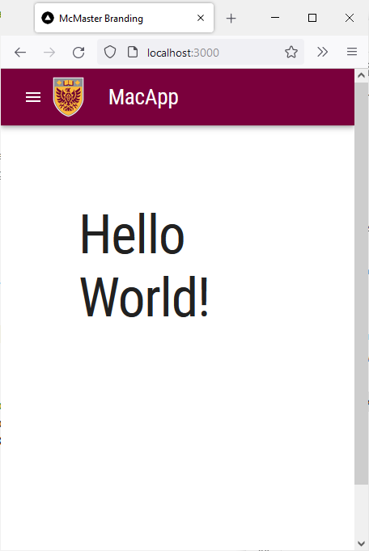
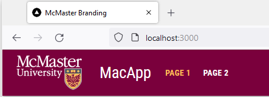
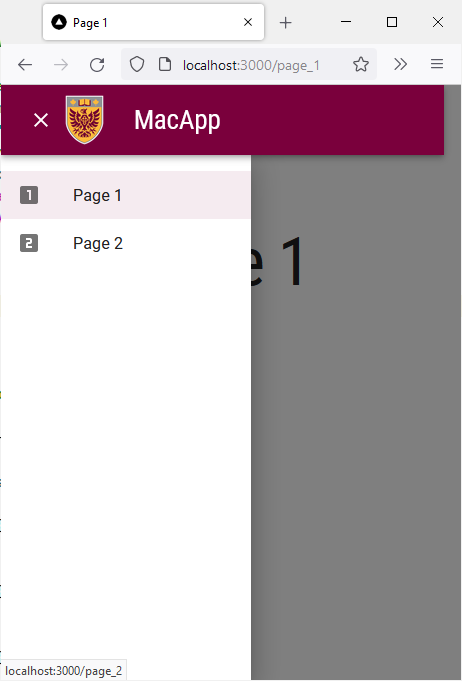
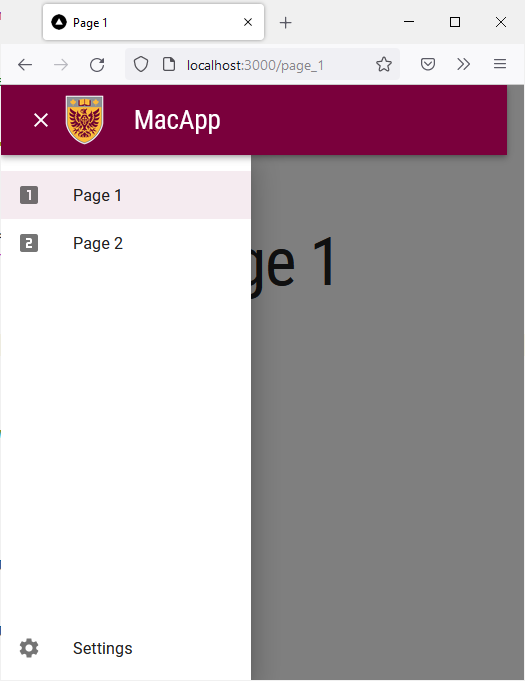
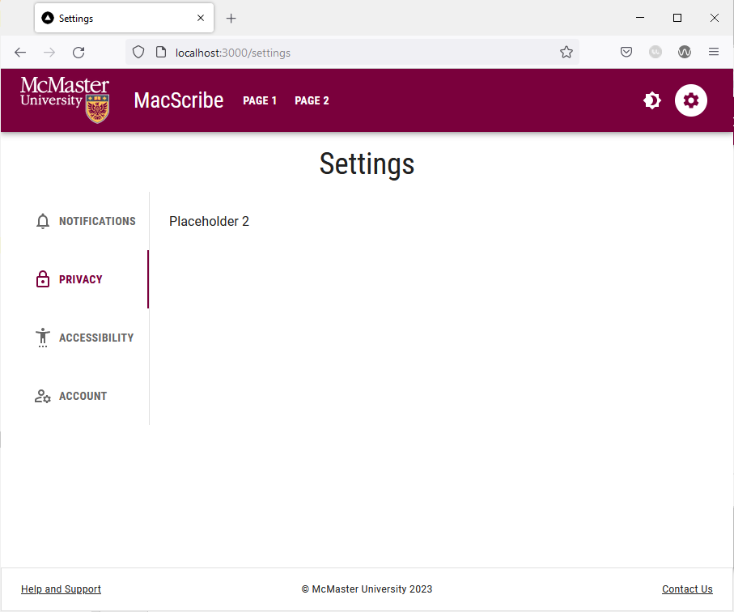
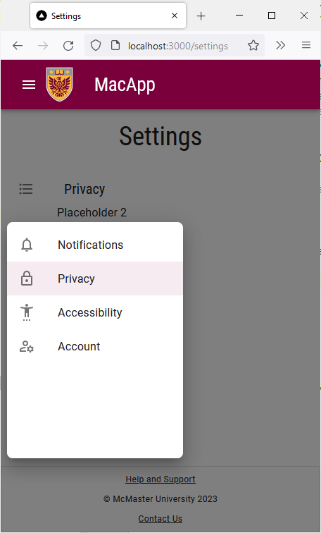

# Navigation Bar

When most people visit a website for the first time, the navigation bar (NavBar) is the first element that catches their attention. A responsive navigation bar links the different pages of a website together and provides the user with contextual information to identify which page they are currently on in addition to helping them understand the structure of the website. Consequently, having a responsive navigation bar is integral for creating a website that is intuitive and easy to navigate. In this section, we will learn how to create a responsive navigation bar using the [`AppBar`](https://mui.com/material-ui/react-app-bar/) component of Material UI. 

### Define the Palette Colors & Border Radius
Start by defining the primary and secondary colors of your theme. The McMaster Digital Brand Standards specify that the primary color should be McMaster Heritage Maroon and the secondary color is McMaster Heritage Gold.

Modify `theme.ts` by adding the following code at the beginning of the `themeOptions` object:
```
palette: {  
	primary: {  
		main: "#7a003c"  
	},  
	secondary: {  
		main: "#fdbf57"  
	}  
},
```
In this code snippet, we are defining the primary and secondary colors of our website using the hex values that corresponding to the McMaster Heritage Maroon and Heritage Gold colors.

Next, we will set the border radius in the them to 28 and the border radius for the `MuiPaper` component to 8 inside `themeOptions`:
```
shape: {  
	borderRadius: 28,  
},
components: {
	MuiPaper: {
		styleOverrides: {
			root: {
				borderRadius: 8,
			},
		},
	},
}
```
Note that the shape `borderRadius` sets the global value of the border radius for all MUI components, we will modify the border radius of individual components as needed just like we did for the `MuiPaper` component.

Your `theme.ts` file should now look like this:
```
declare module '@mui/material/Typography' {
    interface TypographyPropsVariantOverrides {
        settingTitle: true;
    }
}

const themeOptions = {
	palette: {  
		primary: {  
			main: "#7a003c"  
		},  
		secondary: {  
			main: "#fdbf57"  
		}  
	},
    typography: {
        h1: {
            fontFamily: 'Roboto Condensed',
            fontSize: '50pt',
        },
        h2: {
            fontFamily: 'Roboto Condensed',
            fontSize: '28pt',
            fontWeight: 400,
        },
        h3: {
            fontFamily: 'Roboto Condensed',
            fontSize: '20pt',
        },
        h4: {
            fontFamily: 'Roboto',
            fontSize: '13pt',
            fontWeight: 900,
        },
        button: {
            fontFamily: 'Roboto Condensed',
            fontWeight: 700,
        },
    },
    shape: {  
		borderRadius: 28,  
	},
	components: {
        MuiPaper: {
            styleOverrides: {
                root: {
                    borderRadius: 8,
                },
            },
        },
    }
}

export default themeOptions
```

### Add the Material Icons Library to Your Application
Our navigation bar will include icons that link to a page. Material UI offers a complete library of icons known as Material Icons that conform to the Material UI design language. We will add this library to our project so that we can use the icons in our navigation bar.

Navigate to the your project's directory if you are not already in it: 
~~~
cd mac-branding-mui
~~~

Run the following command to add the MUI library to your project using the `npm` package manager: 
~~~
npm install @mui/icons-material @mui/material @emotion/styled @emotion/react
~~~
You will be presented with the following message `added 1 package, changed 14 packages, and audited 359 packages in 22s` if the installation is successful. Some of the numbers in the message may be different for you.

### Create `Navbar.module.css`
In the `styles` directory of your project, create a new file called `Navbar.module.css`. This file will contain the CSS styles used for the links in our navigation bar. We will define the colors of the links in their active, non-active and hover states:
- Non-active links should be white and turn heritage gold when you hover over them.
- Active links should have a white background and the link text should be heritage maroon.

Add the following lines to `Navbar.module.css`:

```
/* Specific styles for non-active navbar links */
.nonActive {
    color: white;
}

/* Specific styles for active navbar links */
.active {
    color: #7a003c;
    background: white;
}

.active:hover {
    color: #7a003c;
    background: white;
}

.title:hover {
    color: #fdbf57;
}
```

### Download the McMaster Logo
Download the McMaster logo using the [Brand Standards](https://brand-resources.mcmaster.ca/asset-bank/action/viewAsset?id=7000&index=3&total=17&view=viewSearchItem)website. Note that you will need to sign in with your MacID to download the logo. Rename the downloaded file to `logo.png`.
In the `public` directory of your project, create a new directory called `assets`. Place `logo.png` in the `assets` directory.

We will also need the McMaster crest logo that can be downloaded from the following [link](https://www.pngwing.com/en/free-png-mqbcf).   Rename the downloaded file to `logo-small.png` and place it in the `assets` directory.

### Create Styled Icon Buttons
We will now proceed to create a styled  `IconButton` for use in our navigation bar.
Create a new directory called `MacComponents` inside the `components` directory. Create a new file in this directory called `MacNavButton.tsx` and add the following code to it:
```

import {styled, useTheme} from '@mui/material/styles'
import IconButton from '@mui/material/IconButton'

export const MacIconNavButton = styled(IconButton)(props => ({
    ':hover': {
        backgroundColor: "transparent",
        color: useTheme().palette.secondary.main,
    },
    '&& .MuiTouchRipple-child': {
        backgroundColor: "#D6D6D6",
    },
})) as typeof IconButton

```
The `MacIconNavButton` component is a styled MUI `IconButton`. We set the icon color to heritage gold and make the background transparent when hovering over the icon button. We also added a ripple affect to the icon button that appears when the user clicks on it. 

### Create the `NavBar` Component
In the root directory of your project, create a `components` directory. Create another directory inside the `components` directory called `Navbar`. Create a file named `Navbar.tsx` in this directory.

Add the following import statements to to `Navbar.tsx`:
```
import * as React from 'react'  
import AppBar from '@mui/material/AppBar'  
import Box from '@mui/material/Box'  
import Toolbar from '@mui/material/Toolbar'  
import Typography from '@mui/material/Typography'  
import MenuIcon from '@mui/icons-material/Menu'  
import Container from '@mui/material/Container'  
import Link from 'next/link'  
import {useRouter} from 'next/router'  
import styles from '@/styles/NavBar.module.css'  
import {MacIconNavButton,} from '@/components/MacComponents/MacNavButton'  
import {useTheme} from '@mui/material/styles'  
import Tooltip from '@mui/material/Tooltip'  
import Drawer from "@mui/material/Drawer";  
import List from "@mui/material/List";  
import ClearIcon from '@mui/icons-material/Clear';
```

Next, create a multi-dimensional array containing the name of each page and its corresponding `.tsx` file:
```
const pages = [  
	['Page 1', '/page_1'],  
	['Page 2', '/page_2'],  
]
```
We will create the  `.tsx` files shortly.

We will now create the `Navbar` function which returns the `AppBar` component:
```

export default function Navbar() {
    const imgStyle = {
        paddingTop: '10px',
        paddingBottom: '10px',
        paddingRight: '30px',
    }

    const [state, setState] = React.useState(false);

    const toggleDrawer =
        (open: boolean) =>
            (event: React.KeyboardEvent | React.MouseEvent) => {
                if (
                    event.type === 'keydown' &&
                    ((event as React.KeyboardEvent).key === 'Tab' ||
                        (event as React.KeyboardEvent).key === 'Shift')
                ) {
                    return;
                }
                setState(open);
            };


    const pages_drawer = () => (
        <Box
            paddingTop={1}
            sx={{ width:  250 }}
            role="presentation"
            onKeyDown={toggleDrawer(false)}
        >
            <List>
            </List>
        </Box>
    );

    return (
        <AppBar
            position="relative"
            enableColorOnDark
            style={{backgroundImage: 'none'}}
            sx={{zIndex: theme => theme.zIndex.drawer + 1, borderRadius: 0}}
        >
            <Container maxWidth="xl">
                <Toolbar disableGutters>
                    <Box sx={{flexGrow: 1, display: {xs: 'flex', md: 'none'}}}>
                        <Tooltip enterDelay={500} title={state ? "Close App Drawer" : "Open App Drawer"}>
                            <MacIconNavButton
                                size="large"
                                aria-controls="menu-appbar"
                                aria-haspopup="true"
                                onClick={toggleDrawer(!state)}
                                color="inherit"
                            >
                                {state ? <ClearIcon /> : <MenuIcon />}
                            </MacIconNavButton>
                        </Tooltip>
                        <Drawer
                            anchor={"left"}
                            open={state}
                            onClose={toggleDrawer(false)}
                            sx={{
                                '& .MuiDrawer-root': {
                                    position: 'absolute'
                                },
                                '& .MuiPaper-root': {
                                    position: 'absolute',
                                    borderRadius: 0
                                },
                                minWidth: 100,
                                width: "20%",
                                position: "absolute",
                                top: '70px',
                                display: {xs: 'flex', md: 'none'}
                            }}
                        >
                            {pages_drawer()}
                        </Drawer>
                        <Box
                            justifyContent="center"
                            alignItems="center"
                            sx={{alignItems: 'center', display: {xs: 'flex', md: 'none'}}}
                        >
                            <Box
                                component="img"
                                sx={{
                                    height: 70,
                                    width: '100%',
                                }}
                                alt="McMaster Logo"
                                src="/assets/logo-small.png"
                                style={imgStyle}
                            />
                            <Typography
                                variant="h3"
                                component={Link}
                                href="/"
                                sx={{
                                    mr: 2,
                                    flexGrow: 1,
                                    color: 'inherit',
                                    textDecoration: 'none',
                                }}
                                className={styles.title}
                            >
                                MacApp
                            </Typography>
                        </Box>
                    </Box>
                    <Box
                        component="img"
                        sx={{
                            height: 78.31,
                            width: 140,
                            display: {xs: 'none', md: 'flex'}
                        }}
                        alt="McMaster Logo"
                        src="/assets/logo.png"
                        style={imgStyle}
                    />
                    <Typography
                        variant="h3"
                        noWrap
                        component={Link}
                        href="/"
                        sx={{
                            mr: 2,
                            display: {xs: 'none', md: 'flex'},
                            textDecoration: 'none',
                            color: 'inherit',
                        }}
                        className={styles.title}
                    >
                        MacApp
                    </Typography>
                </Toolbar>
            </Container>
        </AppBar>
    );
}

```
So far, our code creates an `AppBar` component with the McMaster logo on the left hand side along with the title of our application (MacApp). Medium and large displays will show the full-sized McMaster logo, whereas small displays will only show the McMaster crest. We use the `sx` and `md` breakpoints in the `display` field of the `sx` prop to determine which component should b rendered on small and medium displays respectively. The title is a button that can be clicked to go back to the main index page of our application, which in this case is the 'Hello World!' page.
Notice that the navigation bar has two `Typography` components containing the title of our application. The first `Typography` component is used for medium-sized screen (e.g., tablets, laptops, desktop computers, etc.) whereas the second `Typography` component is used for small screens (e.g., smartphones). On small screens, we render a `MacIconNavButton` component that open an app drawer that houses the navigation links that we will add at a later stage in this workshop. The `toggleDrawer` function is used to handle opening and closing the app drawer shown in the navigation bar on small-sized screens.

### Import and Use `Navbar`
The navigation bar should appear on all pages of our website. As such, we will import and use it in the `_app.tsx` file, given that components used in this file are shown on all pages. 

Open the `_app.tsx` file and import `NavBar`:
```
import Navbar from "@/components/Navbar/Navbar";
```
Add the following line of code before `<CssBaseline />`:
```
<Navbar />
```
Your `_app.tsx` file should now look like this:
```

import type { AppProps } from 'next/app'  
import CssBaseline from '@mui/material/CssBaseline'  
import {createTheme, ThemeProvider} from '@mui/material/styles'  
import themeOptions from '@/config/theme'  
  
export default function App({ Component, pageProps }: AppProps) {  
	const theme = createTheme({  
		...themeOptions  
	});  
	return <>  
		<ThemeProvider theme={theme}>  
			<Navbar />
			<CssBaseline />  
			<Component {...pageProps} />  
		</ThemeProvider>  
	</>  
}

```

Go back to your browser, the page should now have a McMaster-branded navigation bar:

If you hover over the "MacApp" button, the text should turn heritage gold indicating that this is a clickable link.

Try decreasing the width of your window and notice how the title of the app title will be centered and a new menu icon will be shown:


### Create Additional Pages
Start by creating an additional `page` CSS style in `Home.module.css`:
```
.page {
  display: flex;
  flex-direction: column;
  justify-content: space-between;
  align-items: center;
  min-height: calc(100vh - 164px);
  padding-top: 1rem;
}
```
We reduced the padding compared to the `main` style.

In the `pages` directory of your project, create a new directory called `page_1`. Create an `index.tsx` file in the `page_1` directory.
Add the following code to the `page_1/index.tsx` file:
```

import styles from '@/styles/Home.module.css'
import Typography from '@mui/material/Typography'
import {useEffect} from "react";
import Container from "@mui/material/Container";
import Box from "@mui/material/Box";

export default function Page_1() {
    useEffect(() => {
        document.title = 'Page 1'
    }, [])

  return (
    <>
      <main className={styles.page}>
          <Container>
              <Box
                  display="flex"
                  justifyContent="center"
                  alignItems="center">
                  <Typography variant="h1">Page 1</Typography>
              </Box>
          </Container>
      </main>
    </>
  )
}
```

Create another directory in `pages` called `page_2` with an `index.tsx` file in it. Add the following code to `page_2/index.tsx`:
```
import styles from '@/styles/Home.module.css'
import Typography from '@mui/material/Typography'
import {useEffect} from "react";
import Container from "@mui/material/Container";
import Box from "@mui/material/Box";

export default function Page_2() {
    useEffect(() => {
        document.title = 'Page 2'
    }, [])
  return (
    <>
      <main className={styles.page}>
          <Container>
              <Box
                  display="flex"
                  justifyContent="center"
                  alignItems="center">
                  <Typography variant="h1">Page 2</Typography>
              </Box>
          </Container>
      </main>
    </>
  )
}

```
These two files create two simple pages that show a title in the middle akin to the main "Hello World!" page. We use the React Effect Hook to add a document title on each page that will be shown as the tab name in your browser.

### Create Styled Buttons
We will now create a styled `Button` for use in our navigation bar.
Inside the previously created `MacComponents/MacNavButton.tsx` file, add the following import statement:
```
import Button from '@mui/material/Button'
```

Next, create and export the styled `MacNavButton` component:
```
export const MacNavButton = styled(Button)(props => ({
    ':hover': {
        backgroundColor: "transparent",
        color: useTheme().palette.secondary.main,
    },
    '&& .MuiTouchRipple-child': {
        backgroundColor: "#D6D6D6",
    },
})) as typeof Button
```

Your `MacComponents/MacNavButton.tsx` file should now containing the following lines of code:
```

import {styled, useTheme} from '@mui/material/styles'
import Button from '@mui/material/Button'
import IconButton from '@mui/material/IconButton'

export const MacNavButton = styled(Button)(props => ({
    ':hover': {
        backgroundColor: "transparent",
        color: useTheme().palette.secondary.main,
    },
    '&& .MuiTouchRipple-child': {
        backgroundColor: "#D6D6D6",
    },
})) as typeof Button

export const MacIconNavButton = styled(IconButton)(props => ({
    ':hover': {
        backgroundColor: "transparent",
        color: useTheme().palette.secondary.main,
    },
    '&& .MuiTouchRipple-child': {
        backgroundColor: "#D6D6D6",
    },
})) as typeof IconButton

```
The `MacNavButton` component is a styled MUI `Button` that behaves similarly to the `MacIconNavButton`. The text color of the button turns to heritage gold when hovering over it. We also added a ripple affect to the button that appears when the user clicks the button. 

### Add Links to the Navigation Bar
Import the `MacNavButton` components in `Navbar.tsx` by updating the import statement of the `MacIconNavButton` as shown below:
```
import {MacIconNavButton, MacNavButton,} from '@/components/MacComponents/MacNavButton'
```

Next, add the following additional import statements:
```
import ListItem from "@mui/material/ListItem";  
import ListItemButton from "@mui/material/ListItemButton";  
import ListItemIcon from "@mui/material/ListItemIcon";  
import ListItemText from "@mui/material/ListItemText";  
import LooksOneIcon from '@mui/icons-material/LooksOne';  
import LooksTwoIcon from '@mui/icons-material/LooksTwo';
```

In the `Navbar` function of `Navbar.tsx`, add the following lines of code after the `toggleDrawer` function declaration:
```

const router = useRouter()  
const currentRoute = router.pathname  
  
const icons = [<LooksOneIcon key={'transcripts-page'} />, <LooksTwoIcon key={'privacy-policy'}/>]

```

The code initializes the router object we will use to determine which page the user is currently on. We also defined an array of icons that we will use in the drawer that is shown on small screens.

Modify the `pages_drawer` constant by adding the following lines of code inside the `List` component:
```
 {pages.map((page, index) => (
	<ListItem key={page[0]} disablePadding>
		<ListItemButton onClick={toggleDrawer(false)} component={Link} href={page[1]} selected= {currentRoute === page[1]} >
			<ListItemIcon>
				{icons[index]}
			</ListItemIcon>
			<ListItemText primary={page[0]} />
		</ListItemButton>
	</ListItem>
))}
```
We iterate on the `pages` array and add an `ListItem` component for each entry. Each `ListItem` component contains a `ListItemButton`, a `ListItemIcon` and a `ListItemText` component. Each entry is rendered as a clickable link consisting of an icon followed by the name of the page.

Next, we will add the navigation button links shown on medium-sized displays. Add the following code right after the second `Typography` component:
```

<Box sx={{flexGrow: 1, display: {xs: 'none', md: 'flex'}}}>
    {pages.map(page => (
        <MacNavButton
            key={page[0]}
            component={Link}
            href={page[1]}
            className={
                currentRoute === page[1]
                    ? styles.active
                    : styles.nonActive
            }
            sx={{my: 2, color: 'white', display: 'block'}}
        >
            {page[0]}
        </MacNavButton>
    ))}
</Box>
s
```
We modify the `className` of the `MacNavButton` component depending on which page the user is currently on to specify if the button should use the `active` style or the `nonActive` style.

The `Navbar.tsx` file should now contain the following code:
```

import * as React from 'react'
import AppBar from '@mui/material/AppBar'
import Box from '@mui/material/Box'
import Toolbar from '@mui/material/Toolbar'
import Typography from '@mui/material/Typography'
import MenuIcon from '@mui/icons-material/Menu'
import Container from '@mui/material/Container'
import Link from 'next/link'
import {useRouter} from 'next/router'
import styles from '@/styles/NavBar.module.css'
import {MacIconNavButton, MacNavButton,} from '@/components/MacComponents/MacNavButton'
import Tooltip from '@mui/material/Tooltip'
import Drawer from "@mui/material/Drawer";
import List from "@mui/material/List";
import ClearIcon from '@mui/icons-material/Clear';
import ListItem from "@mui/material/ListItem";
import ListItemButton from "@mui/material/ListItemButton";
import ListItemIcon from "@mui/material/ListItemIcon";
import ListItemText from "@mui/material/ListItemText";
import LooksOneIcon from '@mui/icons-material/LooksOne';
import LooksTwoIcon from '@mui/icons-material/LooksTwo';

const pages = [
    ['Page 1', '/page_1'],
    ['Page 2', '/page_2'],
]

export default function Navbar() {
    const imgStyle = {
        paddingTop: '10px',
        paddingBottom: '10px',
        paddingRight: '30px',
    }

    const [state, setState] = React.useState(false);

    const toggleDrawer =
        (open: boolean) =>
            (event: React.KeyboardEvent | React.MouseEvent) => {
                if (
                    event.type === 'keydown' &&
                    ((event as React.KeyboardEvent).key === 'Tab' ||
                        (event as React.KeyboardEvent).key === 'Shift')
                ) {
                    return;
                }
                setState(open);
            };

    const router = useRouter()
    const currentRoute = router.pathname

    const icons = [<LooksOneIcon key={'transcripts-page'} />, <LooksTwoIcon key={'privacy-policy'}/>]

    const pages_drawer = () => (
        <Box
            paddingTop={1}
            sx={{ width:  250 }}
            role="presentation"
            onKeyDown={toggleDrawer(false)}
        >
            <List>
                {pages.map((page, index) => (
                    <ListItem key={page[0]} disablePadding>
                        <ListItemButton onClick={toggleDrawer(false)} component={Link} href={page[1]} selected= {currentRoute === page[1]} >
                            <ListItemIcon>
                                {icons[index]}
                            </ListItemIcon>
                            <ListItemText primary={page[0]} />
                        </ListItemButton>
                    </ListItem>
                ))}
            </List>
        </Box>
    );

    return (
        <AppBar
            position="relative"
            enableColorOnDark
            style={{backgroundImage: 'none'}}
            sx={{zIndex: theme => theme.zIndex.drawer + 1, borderRadius: 0}}
        >
            <Container maxWidth="xl">
                <Toolbar disableGutters>
                    <Box sx={{flexGrow: 1, display: {xs: 'flex', md: 'none'}}}>
                        <Tooltip enterDelay={500} title={state ? "Close App Drawer" : "Open App Drawer"}>
                            <MacIconNavButton
                                size="large"
                                aria-controls="menu-appbar"
                                aria-haspopup="true"
                                onClick={toggleDrawer(!state)}
                                color="inherit"
                            >
                                {state ? <ClearIcon /> : <MenuIcon />}
                            </MacIconNavButton>
                        </Tooltip>
                        <Drawer
                            anchor={"left"}
                            open={state}
                            onClose={toggleDrawer(false)}
                            sx={{
                                '& .MuiDrawer-root': {
                                    position: 'absolute'
                                },
                                '& .MuiPaper-root': {
                                    position: 'absolute',
                                    borderRadius: 0
                                },
                                minWidth: 100,
                                width: "20%",
                                position: "absolute",
                                top: '70px',
                                display: {xs: 'flex', md: 'none'}
                            }}
                        >
                            {pages_drawer()}
                        </Drawer>
                        <Box
                            justifyContent="center"
                            alignItems="center"
                            sx={{alignItems: 'center', display: {xs: 'flex', md: 'none'}}}
                        >
                            <Box
                                component="img"
                                sx={{
                                    height: 70,
                                    width: '100%',
                                }}
                                alt="McMaster Logo"
                                src="/assets/logo-small.png"
                                style={imgStyle}
                            />
                            <Typography
                                variant="h3"
                                component={Link}
                                href="/"
                                sx={{
                                    mr: 2,
                                    flexGrow: 1,
                                    color: 'inherit',
                                    textDecoration: 'none',
                                }}
                                className={styles.title}
                            >
                                MacApp
                            </Typography>
                        </Box>
                    </Box>
                    <Box
                        component="img"
                        sx={{
                            height: 78.31,
                            width: 140,
                            display: {xs: 'none', md: 'flex'}
                        }}
                        alt="McMaster Logo"
                        src="/assets/logo.png"
                        style={imgStyle}
                    />
                    <Typography
                        variant="h3"
                        noWrap
                        component={Link}
                        href="/"
                        sx={{
                            mr: 2,
                            display: {xs: 'none', md: 'flex'},
                            textDecoration: 'none',
                            color: 'inherit',
                        }}
                        className={styles.title}
                    >
                        MacScribe
                    </Typography>
                    <Box sx={{flexGrow: 1, display: {xs: 'none', md: 'flex'}}}>
                        {pages.map(page => (
                            <MacNavButton
                                key={page[0]}
                                component={Link}
                                href={page[1]}
                                className={
                                    currentRoute === page[1]
                                        ? styles.active
                                        : styles.nonActive
                                }
                                sx={{my: 2, color: 'white', display: 'block'}}
                            >
                                {page[0]}
                            </MacNavButton>
                        ))}
                    </Box>
                </Toolbar>
            </Container>
        </AppBar>
    );
}

```

Your webpage should now have two button links in the navigation bar. The buttons will turn heritage gold when you hover over them. 



Clicking on a button will take you to the corresponding page. 

Notice that the button of the active page has a white background to inform the user which page they are currently on. 

On smaller screens the navigation bar will make use of an app drawer, where the active page is highlighted:


### Add a Settings Button
In this section, we will add an icon button that redirects the user to the "Settings" page of our web application. The "Settings" page will use vertical tabs to display and group related controls. We will also learn how to add a tooltip message to an icon button to help our users understand what each icon in our navigation bar signifies. 

Start by adding the following import statement to `Navbar.tsx`:
```
import SettingsIcon from '@mui/icons-material/Settings'
```
We are importing the MUI "Settings" icon (gear icon) for use in our navigation bar and app drawer.

Add the following lines of code immediately after the `Box` component containing the `MacNavButtons` for "Page 1" and "Page 2":
```

<Box sx={{paddingRight: 1}}>
    <Tooltip
        title= "Settings"
    >
        <MacIconNavButton
            aria-label="settings"
            color="inherit"
            component={Link}
            className={
                currentRoute === '/settings'
                    ? styles.active
                    : styles.nonActive
            }
            href="/settings"
        >
            <SettingsIcon />
        </MacIconNavButton>
    </Tooltip>
</Box>

```
We are effectively adding a new `Box` component that contains an instance of the `MacIconNavButton` styled component that we created earlier. The `MacIconNavButton` contains the `SettingsIcon` component that appears as a gear icon. Notice the `MacIconNavButton` is wrapped in a `Tooltip` component which allows us to present the user with a tooltip message when they hover over the gear icon. Currently, the settings icon button is set to redirect the user to the `settings` page, which we will create shortly.

On small screens, the settings link should be displayed at the bottom of the app drawer. Modify the `pages_drawer` function to render a settings link as shown below:
```

const pages_drawer = () => (
	<Box
		paddingTop={1}
		sx={{ width:  250 }}
		role="presentation"
		onKeyDown={toggleDrawer(false)}
>
		<List>
			{pages.map((page, index) => (
				<ListItem key={page[0]} disablePadding>
					<ListItemButton onClick={toggleDrawer(false)} component={Link} href={page[1]} selected= {currentRoute === page[1]} >
						<ListItemIcon>
							{icons[index]}
						</ListItemIcon>
						<ListItemText primary={page[0]} />
					</ListItemButton>
				</ListItem>
			))}
		</List>
		<List style={{ position: "absolute", bottom: "0", right: "0", left: "0"}}>
			<ListItem key={'settings'} disablePadding>
				<ListItemButton onClick={toggleDrawer(false)} component={Link} href={'/settings'} selected= {currentRoute === '/settings'} color="inherit" >
					<ListItemIcon>
						<SettingsIcon />
					</ListItemIcon>
					<ListItemText primary={'Settings'} />
				</ListItemButton>
			</ListItem>
		</List>
	</Box>
);

```

Your `Navbar.tsx` file should now look like this:
```

import * as React from 'react'
import AppBar from '@mui/material/AppBar'
import Box from '@mui/material/Box'
import Toolbar from '@mui/material/Toolbar'
import Typography from '@mui/material/Typography'
import MenuIcon from '@mui/icons-material/Menu'
import Container from '@mui/material/Container'
import Link from 'next/link'
import {useRouter} from 'next/router'
import styles from '@/styles/NavBar.module.css'
import {MacIconNavButton, MacNavButton,} from '@/components/MacComponents/MacNavButton'
import Tooltip from '@mui/material/Tooltip'
import Drawer from "@mui/material/Drawer";
import List from "@mui/material/List";
import ClearIcon from '@mui/icons-material/Clear';
import ListItem from "@mui/material/ListItem";
import ListItemButton from "@mui/material/ListItemButton";
import ListItemIcon from "@mui/material/ListItemIcon";
import ListItemText from "@mui/material/ListItemText";
import LooksOneIcon from '@mui/icons-material/LooksOne';
import LooksTwoIcon from '@mui/icons-material/LooksTwo';
import SettingsIcon from '@mui/icons-material/Settings'

const pages = [
    ['Page 1', '/page_1'],
    ['Page 2', '/page_2'],
]

export default function Navbar() {
    const imgStyle = {
        paddingTop: '10px',
        paddingBottom: '10px',
        paddingRight: '30px',
    }

    const [state, setState] = React.useState(false);

    const toggleDrawer =
        (open: boolean) =>
            (event: React.KeyboardEvent | React.MouseEvent) => {
                if (
                    event.type === 'keydown' &&
                    ((event as React.KeyboardEvent).key === 'Tab' ||
                        (event as React.KeyboardEvent).key === 'Shift')
                ) {
                    return;
                }
                setState(open);
            };

    const router = useRouter()
    const currentRoute = router.pathname

    const icons = [<LooksOneIcon key={'transcripts-page'} />, <LooksTwoIcon key={'privacy-policy'}/>]

    const pages_drawer = () => (
        <Box
            paddingTop={1}
            sx={{ width:  250 }}
            role="presentation"
            onKeyDown={toggleDrawer(false)}
        >
            <List>
                {pages.map((page, index) => (
                    <ListItem key={page[0]} disablePadding>
                        <ListItemButton onClick={toggleDrawer(false)} component={Link} href={page[1]} selected= {currentRoute === page[1]} >
                            <ListItemIcon>
                                {icons[index]}
                            </ListItemIcon>
                            <ListItemText primary={page[0]} />
                        </ListItemButton>
                    </ListItem>
                ))}
            </List>
            <List style={{ position: "absolute", bottom: "0", right: "0", left: "0"}}>
                <ListItem key={'settings'} disablePadding>
                    <ListItemButton onClick={toggleDrawer(false)} component={Link} href={'/settings'} selected= {currentRoute === '/settings'} color="inherit" >
                        <ListItemIcon>
                            <SettingsIcon />
                        </ListItemIcon>
                        <ListItemText primary={'Settings'} />
                    </ListItemButton>
                </ListItem>
            </List>
        </Box>
    );

    return (
        <AppBar
            position="relative"
            enableColorOnDark
            style={{backgroundImage: 'none'}}
            sx={{zIndex: theme => theme.zIndex.drawer + 1, borderRadius: 0}}
        >
            <Container maxWidth="xl">
                <Toolbar disableGutters>
                    <Box sx={{flexGrow: 1, display: {xs: 'flex', md: 'none'}}}>
                        <Tooltip enterDelay={500} title={state ? "Close App Drawer" : "Open App Drawer"}>
                            <MacIconNavButton
                                size="large"
                                aria-controls="menu-appbar"
                                aria-haspopup="true"
                                onClick={toggleDrawer(!state)}
                                color="inherit"
                            >
                                {state ? <ClearIcon /> : <MenuIcon />}
                            </MacIconNavButton>
                        </Tooltip>
                        <Drawer
                            anchor={"left"}
                            open={state}
                            onClose={toggleDrawer(false)}
                            sx={{
                                '& .MuiDrawer-root': {
                                    position: 'absolute'
                                },
                                '& .MuiPaper-root': {
                                    position: 'absolute',
                                    borderRadius: 0
                                },
                                minWidth: 100,
                                width: "20%",
                                position: "absolute",
                                top: '70px',
                                display: {xs: 'flex', md: 'none'}
                            }}
                        >
                            {pages_drawer()}
                        </Drawer>
                        <Box
                            justifyContent="center"
                            alignItems="center"
                            sx={{alignItems: 'center', display: {xs: 'flex', md: 'none'}}}
                        >
                            <Box
                                component="img"
                                sx={{
                                    height: 70,
                                    width: '100%',
                                }}
                                alt="McMaster Logo"
                                src="/assets/logo-small.png"
                                style={imgStyle}
                            />
                            <Typography
                                variant="h3"
                                component={Link}
                                href="/"
                                sx={{
                                    mr: 2,
                                    flexGrow: 1,
                                    color: 'inherit',
                                    textDecoration: 'none',
                                }}
                                className={styles.title}
                            >
                                MacApp
                            </Typography>
                        </Box>
                    </Box>
                    <Box
                        component="img"
                        sx={{
                            height: 78.31,
                            width: 140,
                            display: {xs: 'none', md: 'flex'}
                        }}
                        alt="McMaster Logo"
                        src="/assets/logo.png"
                        style={imgStyle}
                    />
                    <Typography
                        variant="h3"
                        noWrap
                        component={Link}
                        href="/"
                        sx={{
                            mr: 2,
                            display: {xs: 'none', md: 'flex'},
                            textDecoration: 'none',
                            color: 'inherit',
                        }}
                        className={styles.title}
                    >
                        MacScribe
                    </Typography>
                    <Box sx={{flexGrow: 1, display: {xs: 'none', md: 'flex'}}}>
                        {pages.map(page => (
                            <MacNavButton
                                key={page[0]}
                                component={Link}
                                href={page[1]}
                                className={
                                    currentRoute === page[1]
                                        ? styles.active
                                        : styles.nonActive
                                }
                                sx={{my: 2, color: 'white', display: 'block'}}
                            >
                                {page[0]}
                            </MacNavButton>
                        ))}
                    </Box>
                    <Box sx={{paddingRight: 1, display: {xs: 'none', md: 'flex'}}}>
                        <Tooltip title="Settings">
                            <MacIconNavButton
                                aria-label="settings"
                                color="inherit"
                                component={Link}
                                className={
                                    currentRoute === '/settings'
                                        ? styles.active
                                        : styles.nonActive
                                }
                                href="/settings"
                            >
                                <SettingsIcon />
                            </MacIconNavButton>
                        </Tooltip>
                    </Box>
                </Toolbar>
            </Container>
        </AppBar>
    );
}

```

Your navigation bar should now contain a settings icon on the right hand side. Hovering your mouse over the settings icon will turn it heritage gold and display a tooltip message.

Try reducing the width of your browser window to simulate a small-screen device. The app drawer will have a settings link at the bottom of the list.



### Creating the `VerticalTabs` Component
As previously mentioned, our settings page will make use of vertical tabs to group related controls. We will now create our custom `VerticalTabs` component using the MUI `Tab` component.

In the `components` directory, create a subdirectory called `TabPanel`. Inside this new subdirectory, create a file called `VerticalTabs.tsx`.

Add the following code to `VerticalTabs.tsx`:
```

import * as React from 'react'
import Tabs from '@mui/material/Tabs'
import Tab from '@mui/material/Tab'
import Typography from '@mui/material/Typography'
import Box from '@mui/material/Box'
import Drawer from '@mui/material/Drawer';
import List from '@mui/material/List';
import ListItem from '@mui/material/ListItem';
import ListItemButton from '@mui/material/ListItemButton';
import ListItemIcon from '@mui/material/ListItemIcon';
import ListItemText from '@mui/material/ListItemText';
import NotificationsNoneOutlinedIcon from '@mui/icons-material/NotificationsNoneOutlined';
import LockOutlinedIcon from '@mui/icons-material/LockOutlined';
import SettingsAccessibilityOutlinedIcon from '@mui/icons-material/SettingsAccessibilityOutlined';
import ManageAccountsOutlinedIcon from '@mui/icons-material/ManageAccountsOutlined';
import FormatListBulletedOutlinedIcon from '@mui/icons-material/FormatListBulletedOutlined';
import IconButton from "@mui/material/IconButton";

interface TabPanelProps {
    children?: React.ReactNode
    index: number
    value: number
}

function TabPanel(props: TabPanelProps) {
    const {children, value, index, ...other} = props

    return (
        <div
            role="tabpanel"
            hidden={value !== index}
            id={`vertical-tabpanel-${index}`}
            aria-labelledby={`vertical-tab-${index}`}
            {...other}
        >
            {value === index && (
                <Box sx={{p: 3}}>
                    <Typography>{children}</Typography>
                </Box>
            )}
        </div>
    )
}

function a11yProps(index: number) {
    return {
        id: `vertical-tab-${index}`,
        'aria-controls': `vertical-tabpanel-${index}`,
    }
}


export default function VerticalTabs() {
    const [value, setValue] = React.useState(0)

    const handleChange = (event: React.SyntheticEvent, newValue: number) => {
        setValue(newValue)
    }

    const tabs = ['Notifications', 'Privacy', 'Accessibility', 'Account'];
    const icons = [<NotificationsNoneOutlinedIcon key={'notifications'}/>, <LockOutlinedIcon key={'privacy'}/>, <SettingsAccessibilityOutlinedIcon key={'accessibility'}/>, <ManageAccountsOutlinedIcon key={'account'}/>]

    const handleChangeDrawer = (e: React.MouseEvent<HTMLDivElement>, newValue: number) => {
        setValue(newValue);
    }

    const [state, setState] = React.useState(false);

    const toggleDrawer =
        (open: boolean) =>
            (event: React.KeyboardEvent | React.MouseEvent) => {
                if (
                    event.type === 'keydown' &&
                    ((event as React.KeyboardEvent).key === 'Tab' ||
                        (event as React.KeyboardEvent).key === 'Shift')
                ) {
                    return;
                }
                setState(open);
            };

    const list = () => (
        <Box
            sx={{ width:  250 }}
            role="presentation"
            onClick={toggleDrawer(false)}
            onKeyDown={toggleDrawer(false)}
        >
            <List>
                {tabs.map((text, index) => (
                    <ListItem key={text} disablePadding>
                        <ListItemButton selected= {value === index} onClick={(e) => handleChangeDrawer(e, index)}>
                            <ListItemIcon>
                                {icons[index]}
                            </ListItemIcon>
                            <ListItemText primary={text} />
                        </ListItemButton>
                    </ListItem>
                ))}
            </List>
        </Box>
    );

    return (
        <>
            <Box sx={{flexGrow: 1, bgcolor: 'background.paper', display: 'flex'}}>
                <Tabs
                    orientation="vertical"
                    variant="scrollable"
                    value={value}
                    onChange={handleChange}
                    aria-label="Vertical tabs"
                    sx={{borderRight: 1, borderColor: 'divider', display: {xs: 'none', md: 'flex'}}}
                >
                    {tabs.map((text, index) => (
                        <Tab key={text} label={text} icon={icons[index]} iconPosition="start" {...a11yProps(index)} sx={{justifyContent: 'left'}} />
                    ))}
                </Tabs>
                <Box sx={{paddingTop: '19px'}}>
                    <IconButton title="Settings Drawer" aria-label="settings-menu" onClick={toggleDrawer(true)} sx={{ display: {xs: 'inline', md: 'none'}, height:'40px'}}> <FormatListBulletedOutlinedIcon /> </IconButton>
                </Box>
                <Drawer
                    anchor={"left"}
                    open={state}
                    onClose={toggleDrawer(false)}
                    sx={{
                        '& .MuiDrawer-root': {
                            position: 'absolute'
                        },
                        '& .MuiPaper-root': {
                            position: 'absolute'
                        },
                        minWidth: 100,
                        width: "20%",
                        position: "absolute",
                        top: '230px',
                        left: '2%',
                        height: '50%',
                        display: {xs: 'flex', md: 'none'}
                    }}                        >
                    {list()}
                </Drawer>
                <TabPanel value={value} index={0}>
                    <Typography
                        sx={{display: {xs: 'flex', md: 'none'}, justifyContent: 'left', paddingLeft: '10px'}}
                        variant="settingTitle"
                        gutterBottom
                    >
                        Notifications
                    </Typography>
                    Placeholder
                </TabPanel>
                <TabPanel value={value} index={1}>
                    <Typography
                        sx={{display: {xs: 'flex', md: 'none'}, justifyContent: 'left', paddingLeft: '10px'}}
                        variant="settingTitle"
                        gutterBottom
                    >
                        Privacy
                    </Typography>
                    Placeholder
                </TabPanel>
                <TabPanel value={value} index={2}>
                    <Typography
                        sx={{display: {xs: 'flex', md: 'none'}, justifyContent: 'left', paddingLeft: '10px'}}
                        variant="settingTitle"
                        gutterBottom
                    >
                        Accessibility
                    </Typography>
                    Placeholder
                </TabPanel>
                <TabPanel value={value} index={3}>
                    <Typography
                        sx={{display: {xs: 'flex', md: 'none'}, justifyContent: 'left', paddingLeft: '10px'}}
                        variant="settingTitle"
                        gutterBottom
                    >
                        Account
                    </Typography>
                    Placeholder
                </TabPanel>
            </Box>
        </>
    )
}

```

The layout of the `VerticalTabs` changes depending on the display size of the device viewing the page. We created a custom `TabPanel` component that will house the content of each tab in our panel. For medium and large displays, we made use of the MUI `Tabs` component with several children `Tab` components containing the label of each tab. The tabs are displayed vertically on the left hand side of the screen. The `handleChange` function allows the user to easily switch between the tabs by clicking on the desired label. Currently, each tab panel contains a simple placeholder string. We will add styled form controls to some of the panels in a later section of this workshop. On small screens, the tabs are automatically moved to `Drawer` components that can be activated using an `IconButton`. Switching between the `Tabs` and `Drawer` components by resizing the browser window will save the user's current position (i.e., the current tab that they are on). The current active tab is always highlighted on both the full-sized tabs as well as the drawer.

### Create the Settings Page
Start by creating a CSS style for the settings page. Add the following lines to `styles/Home.module.css`:
```
.settings {
  display: flex;
  flex-direction: column;
  justify-content: space-between;
  align-items: center;
  min-height: calc(100vh - 164px);
  padding-top: 1rem;
  padding-bottom: 2rem;
}
```
We reduced the padding used at the top and bottom of the settings page compared to the `.main` style.

Now that our `VerticalTabs` component is complete, we will create the settings page index file. In the `pages` directory of your project, create a new `settings` subdirectory. Create an `index.tsx` file in this directory.

Add the following code to `settings/index.tsx`:
```

import styles from '@/styles/Home.module.css'
import Typography from '@mui/material/Typography'
import * as React from 'react'
import {useEffect} from 'react'
import Box from '@mui/material/Box'
import VerticalTabs from '@/components/TabPanel/VerticalTabs'
import {Container} from '@mui/material'

export default function Settings() {
    useEffect(() => {
        document.title = 'Settings'
    }, [])

    return (
        <main className={styles.settings}>
            <Container>
                <Typography
                    sx={{display: 'flex', justifyContent: 'center'}}
                    variant="h2"
                    gutterBottom
                >
                    Settings
                </Typography>
                <Box sx={{width: '100%', maxWidth: 1000}}>
                    <VerticalTabs />
                </Box>
            </Container>
        </main>
    )
}

```
We added `Container` that includes a `Typography` component to display the title of the page using the `h2` variant. We also added a `Box` component containing the `VerticalTabs`. The Effect Hook is used to change the document title shown in the browser tab.



Go back to your browser and try clicking on the settings icon in the navigation bar. You will be redirected to the settings page with the vertical tabs. You can easily switch tabs by clicking on the label of the desired tab. Try shrinking your browser window horizontally and notice how the `VerticalTabs` component scales accordingly. 

