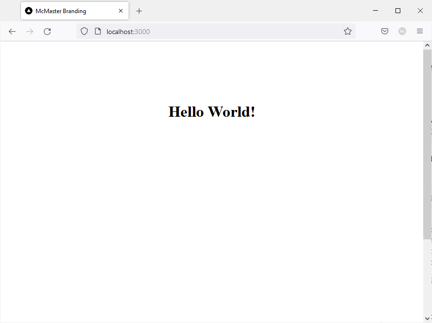

# Pre-module Material

We will start by providing a brief introduction to the programming languages, frameworks and tools used in this learning module. We will also guide you through the process of creating and setting up the single-page application used in this learning module on your local machine.

_Image retrieved from [itnext.io](https://itnext.io/next-js-with-material-ui-7a7f6485f671)_

## Terminology 

- **JavaScript (JS):** a programming language used to create dynamic and interactive websites. JavaScript enables web developers to creates web pages that include animated graphics, interactive forms, dynamic content feeds, etc. Websites created using JavaScript can respond to the user's actions and change the content layout in real time. As the language grew in popularity, JavaScript developers created libraries, frameworks, and programming practices to facilitate and streamline the process of web development. Today, you can use JavaScript for both client-side and server-side development with a variety of frameworks and tools that enhance its functionality.
- **TypeScript (TS):** a strongly typed programming language that builds on JavaScript. As a superset of JavaScript, TypeScript adds additional syntax and support for types, which helps developer catch type-related bugs early on in the development process. TypeScript code is converted to JavaScript, and thus runs anywhere that JavaScript is supported.
- **Library:** In the context of programming and computer science, a library is defined as a set of prewritten code that performs a specified function and helps developers simplify their code and build programs faster by reducing the need to write code for every single action from scratch. A library can include programmatic functions or visual components.
- **Framework:** In the programming world, a framework a structure that you can build software on. It serves as a foundation, so developers are not starting entirely from scratch. Frameworks are often associated with a specific programming language. A framework combines reusable pieces of code written to perform common tasks and user-provided code to create a custom application or website with new capabilities. Using a framework allows developers to focus on implementing high-level functionalities, while the low-level functions of the program are handled by the framework itself.
- **React:** a free, open-source JavaScript library used to build websites by combining reusable components to form an application's user interface. React’s primary role is to handle the view layer of the web application by providing an efficient rendering execution. Rather than dealing with the whole user interface as a single unit, React separates complex UI elements into individual components that form the building blocks of the whole UI. By using the React library, developers can build websites faster compared to vanilla JavaScript. Note that React is considered a library and not a framework because it does not include all the tools needed to build a website. There are many React-based frameworks that augment React with the additional tools needed to build a full-fledged website such as Angular (created by Google), Vue.js, Next.js, etc. 
- **Single-Page Application (SPA):** a website that dynamically rewrites a single webpage with new data from the web server, thus allowing the user to navigate the entire website with the need to reload the page. An SPA differs from a traditional website where the server re-renders a full page with every click the user makes and sends an entire new page to the browser.
- **Next.js**: a flexible React framework that gives developers building blocks to create fast single-page web applications. Next.js gives developers all the tools they need to handle the functionalities of a modern website including rendering, routing, data fetching, integrations, etc. Next.js is compatible with JavaScript as well as TypeScript and can be combined with numerous other libraries.  
- **Material UI (MUI):** a widely used open-source React component library that implements Google’s [Material Design](https://m2.material.io/). The library includes an extensive collection of prebuilt components (e.g., buttons, dropdown menus, data grids, cards, etc.) that are ready for use in production right out of the box. Material UI offers comprehensive styling tools that allow you to customize the design system of its components. Material UI allows you to build websites faster and enjoys a great deal of support in the React community given that it is the largest UI community in the React ecosystem.
- **Node Package Manage (`npm`):** an open-source repository of JavaScript tools and software packages that developers use to create applications and websites. `npm` also acts as a package manager that allows the users to add or remove packages using a command line interface.
- **Visual Studio Code:** a source-code editor developed by Microsoft that support numerous programming languages and extensions that augment it with additional functionalities and allow it to work seamlessly with other software development tools.  
- **WebStorm:** a JavaScript/TypeScript integrated development environment (IDE) developed by JetBrains. WebStorm helps developers create websites by highlighting syntax and semantic errors as they type code into the editor. WebStorm also includes a slew of built-in developer tools that can detect duplicate code fragments, common errors or redundancies and refactor the code to address these issues.

## Pre-module Setup

Please follow these steps to install Node.js and create a Next.js application **before** starting the learning module.

If you are using Windows or MacOS, use one of the installers from the [Node.js download page](https://nodejs.org/en/download/). Be sure to install the version labeled **LTS**. Other versions have not yet been tested with `npm`.

If you are using a Linux distribution, you can install Node.js using the `apt` package manager.
1. Start by refreshing your local package index: 
~~~
sudo apt update
~~~
2. Install Node.js: 
~~~
sudo apt install nodejs
~~~
3. Verify that the installation was successful: 
~~~
node -v
~~~
  You should be presented with the version of Node.js that you just installed.
4. Install the `npm` package manager:
~~~
sudo apt install npm
~~~

### Create a Next.js Application
Once you have Node.js installed, you can create a template Next.js application using the following command:
```npx create-next-app```
You will need to pick a name for your application and specify a few preferences as shown below:


### Start the Development Server
`cd` into the your project directory: 
~~~
cd lmr_building-modern-spas
~~~
Start the development server:
~~~
npm run dev
~~~

### View Default Landing Page
Open your browser of choice and navigate to: `localhost:3000`
You should be presented with the following page:


### Modify `page.module.css`
Create a `styles` directory in the root directory of your project. Move the `page.module.css` file to the `styles` directory.
Open the `page.module.css` file located in the `app` directory and change the `min-height` value from `100vh` to `calc(100vh - 164px)`:
```
.main {
  display: flex;
  flex-direction: column;
  justify-content: space-between;
  align-items: center;
  padding: 6rem;
  min-height: calc(100vh - 164px);
  margin-top: auto;
}
```
This change will reduce the amount of whitespace on the main page.

Similarly, update the `import ./page.module.css` statement in `layout.tsx` as shown below:
```
import styles from '../styles/page.module.css'
```

### Modify `layout.tsx`
Using the text editor or IDE of your choice, modify the `app/layout.tsx` file located in the `app` directory by selecting and change the title of the application by modifying line 8.

Enter the new title as shown below:
```
export const metadata: Metadata = {
  title: 'McMaster Branding',
  description: 'Generated by create next app',
}
```

**Delete** the `import ./global.css` statement.

**Delete** the following lines as well:
```
import { Inter } from 'next/font/google'

const inter = Inter({ subsets: ['latin'] })
```

Update the `<body>` component as shown below:
```
<body>{children}</body>
```

Your `layout.tsx` file should now contain the following lines of code:
```
import type { Metadata } from 'next'

export const metadata: Metadata = {
  title: 'McMaster Branding',
  description: 'Generated by create next app',
}

export default function RootLayout({
  children,
}: {
  children: React.ReactNode
}) {
  return (
    <html lang="en">
      <body>{children}</body>
    </html>
  )
}
```

### Modify the Main Page
Open the `app/page.tsx` file and delete all the lines between the `<main className={styles.main}>` and the `</main>` closing tag. Delete the `Image` import statement `import Image from 'next/image'`.

Add the `use client` directive before the import statement:
```
'use client';
```

Add the following line of code inside the `main` component:  
`<h1> Hello World!</h1>`

Your `app/page.tsx` file should now look like this:
```
'use client';

import styles from '../styles/page.module.css'

export default function Page() {
  return (
    <main className={styles.main}>
      <h1> Hello World!</h1>
    </main>
  )
}
```

Go back to your browser tab, the page should now look like this:


### Add the Material UI Library to Your Application
Navigate to the your project's directory if you are not already in it: 
~~~
cd lmr_building-modern-spas
~~~

Run the following command to add the MUI library to your project using the `npm` package manager: 
~~~
npm install @mui/material @emotion/react @emotion/styled @mui/icons-material
~~~
You will be presented with the following message `added 59 packages, and audited 358 packages in 6s` if the installation is successful. Some of the numbers in the message may be different for you.
