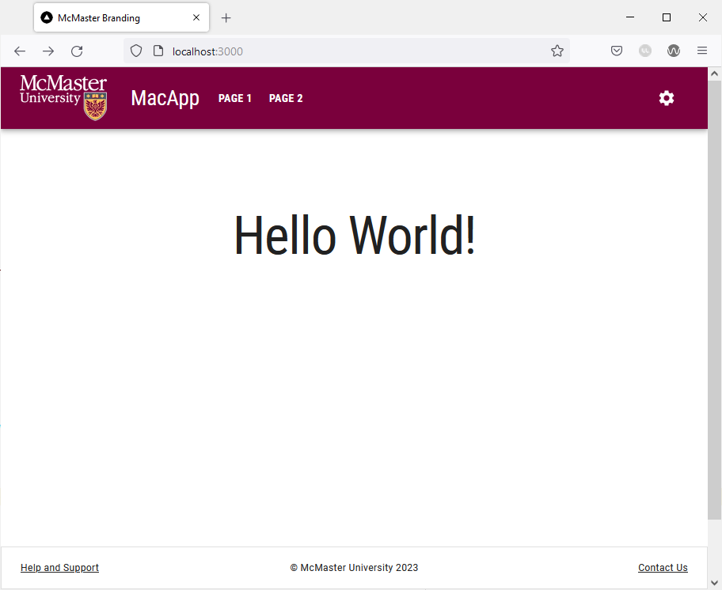

# Footer

A website footer provides users with a sense of consistency, as the same information will appear at the bottom of every single page. A footer typically contains copyright notices, disclaimers, and other fine print items. Additionally, footers may also contain links to a support page, contact form or social media accounts. In this section, we will add a footer to our Material UI website using the `Paper` component. 

## Create the `Footer` Component
Create a new directory inside the `components` directory of your project called `Footer`. Create a file named `Footer.tsx` in this directory.

Add the following code to `Footer.tsx`:
```ts

import React from 'react'
import Container from '@mui/material/Container'
import Box from '@mui/material/Box'
import Typography from '@mui/material/Typography'
import Paper from '@mui/material/Paper'
import {Grid} from '@mui/material'
import Link from 'next/link'
import Stack from "@mui/material/Stack";

export default function Footer() {
    return (
        <Paper
            sx={{
                [useTheme().breakpoints.between('xs', 'md')]: {
                    position: 'relative',
                },
                [useTheme().breakpoints.up('md')]: {
                    position: 'fixed',
                },
                bottom: 0,
                width: '100%',
                borderRadius: 0,
                [useTheme().breakpoints.between('xs', 'md')]: {
                    height: '93',
                },
            }}
            component="footer"
            square
            variant="outlined"
        >
            <Container maxWidth="lg">
                <Box
                    sx={{
                        flexGrow: 1,
                        justifyContent: 'center',
                        display: {xs: 'none', md: 'flex'},
                        my: 1,
                    }}
                ></Box>
                <Grid item xs={12} sm={6} md={3} sx={{display: {xs: 'none', md: 'flex'}}}></Grid>
                <Grid
                    sx={{
                        flexGrow: 1,
                        justifyContent: 'space-between',
                        display: {xs: 'none', md: 'flex'}
                    }}
                    container
                    spacing={2}
                >
                    <Grid item xs={12} sm={6} md={3}>
                        <Box
                            sx={{
                                flexGrow: 1,
                                justifyContent: 'flex-start',
                                display: 'flex',
                                mb: 2,
                                alignItems: 'flex-start',
                            }}
                        >
                            <Typography
                                component={Link}
                                href="/support"
                                variant="caption"
                                color="inherit"
                            >
                                Help and Support
                            </Typography>
                        </Box>
                    </Grid>
                    <Grid item xs={12} sm={6} md={3}>
                        <Box
                            sx={{
                                flexGrow: 1,
                                justifyContent: 'center',
                                display: 'flex',
                                mb: 2,
                            }}
                        >
                            <Typography variant="caption" color="inherit">
                                © McMaster University {new Date().getFullYear()}
                            </Typography>
                        </Box>
                    </Grid>

                    <Grid item xs={12} sm={6} md={3}>
                        <Box
                            sx={{
                                flexGrow: 1,
                                justifyContent: 'flex-end',
                                display: 'flex',
                                mb: 2,
                                alignItems: 'flex-end',
                            }}
                        >
                            <Typography
                                component={Link}
                                href="mailto: example@mcmaster.ca"
                                variant="caption"
                                color="inherit"
                            >
                                Contact Us
                            </Typography>
                        </Box>
                    </Grid>
                </Grid>
                <Stack
                    direction="column"
                    justifyContent="space-between"
                    alignItems="center"
                    spacing={1}
                    sx={{display: {xs: 'flex', md: 'none'}}}
                >
                    <Box
                        sx={{
                            flexGrow: 1,
                            justifyContent: 'flex-start',
                            display: 'flex',
                            alignItems: 'flex-start',
                            mt: 1
                        }}
                    >
                        <Typography
                            component={Link}
                            href="/support"
                            variant="caption"
                            color="inherit"
                        >
                            Help and Support
                        </Typography>
                    </Box>

                    <Box
                        sx={{
                            flexGrow: 1,
                            justifyContent: 'center',
                            display: 'flex',
                        }}
                    >
                        <Typography variant="caption" color="inherit">
                            © McMaster University {new Date().getFullYear()}
                        </Typography>
                    </Box>

                    <Box
                        sx={{
                            flexGrow: 1,
                            justifyContent: 'flex-end',
                            display: 'flex',
                            alignItems: 'flex-end',
                        }}
                    >
                        <Typography
                            component={Link}
                            href="mailto: example@mcmaster.ca"
                            variant="caption"
                            color="inherit"
                            sx={{mb: 1}}
                        >
                            Contact Us
                        </Typography>
                    </Box>
                </Stack>
            </Container>
        </Paper>
    )
}

```

We used the `outlined` variant of the MUI `Paper` component to create a footer that is affixed to the bottom of the page. Akin to the navigation bar, the footer has two different layouts depending on the screen size. On large screens, the footer contains a `Grid` with three evenly spaced horizontal `Grid items`. The first `Grid item` is a link to the "Help and Support" page. The middle `Grid item` contains the copyright notice, whereas the last `Grid item` is a "Contact Us" link that starts a new email to the specified email address. On the other hand, small screens will show the same three links stacked vertically using the MUI `Stack` component. 

## Create the Support Page
We will now create a the "Help and Support" page used in the first link of the footer. Create a new subdirectory under the `app` directory called `support`. Create a new `page.tsx` file inside the `support` directory. 

Add the following lines of code the `app/support/page.tsx`:
```ts

'use client';

import styles from '@/styles/page.module.css'
import Typography from '@mui/material/Typography'
import {useEffect} from "react";
import Container from "@mui/material/Container";
import Box from "@mui/material/Box";

export default function Support() {
    useEffect(() => {
        document.title = 'Support'
    }, [])

    return (
        <>
            <main className={styles.page}>
                <Container>
                    <Box
                        display="flex"
                        justifyContent="center"
                        alignItems="center">
                        <Typography variant="h1">Help and Support</Typography>
                    </Box>
                </Container>
            </main>
        </>
    )
}

```

This file creates a simple page that shows a title in the middle of the screen. We use the React Effect Hook to add a document title on the page that will be shown as the tab name in your browser.

## Importing and Using the `Footer` Component
The footer should appear on all pages of our website. Hence, we will import and use it in the `template.tsx` file, given that components used in this file are shown on all pages. 

Open the `template.tsx` file and import `Footer`:
```ts
import Footer from "@/components/Footer/Footer";
```
Add the following line of code after `{children}`:
```ts
<Footer />
```
Your `template.tsx` file should now look like this:
```ts

'use client';  

import Navbar from "@/components/Navbar/Navbar";
import Footer from "@/components/Footer/Footer";
import CssBaseline from "@mui/material/CssBaseline";  
import React from "react";
import {createTheme, ThemeProvider} from '@mui/material/styles'  
import themeOptions from '@/config/theme'  
  
export default function Template({children}: {children?: React.ReactNode} ) {
	const theme = createTheme({  
		...themeOptions  
	});  
	return <>  
		<ThemeProvider theme={theme}>
			<Navbar />
			<CssBaseline />
			{children}
			<Footer />
        </ThemeProvider>
	</>  
}

```

Save the file and go back to your browser. Your page should now have a footer that appears on all pages. 



Try shrinking the size of your browser window. The footer will automatically adjust by stacking the links vertically instead of horizontally as shown in the image below.


Clicking on the "Help and Support" link will redirect you to the support page. The "Contact Us" link will start a new email using the default email client on your system.
