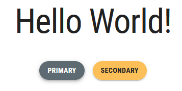

# Interactive UI Elements

Modern websites requires the use of UI elements that not only allow the user to perform a wide range of functions, but also react to the user's actions in an intuitive manner. MUI offers a number of customizable built-in components that adhere to the Material Design Language. In this section, we will learn how to style certain MUI components to conform to the stylistic guidelines set by McMaster Digital Brand Standards Manual. The aim of this section is not to provide a comprehensive tutorial on how to use these different MUI components (this information is covered in the [Material UI Documentation](https://mui.com/material-ui/getting-started/overview/)), but to modify the components' behavior and appearance to fit the McMaster Digital Brand Standards. 

## Buttons
We have already create a styled `MuiButton` component called `MacButton` in the "Breadcrumbs With a Universal Back Button" section. We will now show a couple more examples of how we can use the styled `MacButton` component in different ways.

Open the `app/page.tsx` file and add the following import statements:
```ts
import React from "react";
import Stack from "@mui/material/Stack";  
import Snackbar from '@mui/material/Snackbar';  
import IconButton from '@mui/material/IconButton';  
import CloseIcon from '@mui/icons-material/Close';
```

Declare and export these two interfaces above the `Home` function:
```ts
export interface SnackbarMessage {
    message: string;
    key: number;
}

export interface State {
    open: boolean;
    snackPack: readonly SnackbarMessage[];
    messageInfo?: SnackbarMessage;
}

```

Add the following lines of code at the top of the `Page` function:
```ts
const [snackPack, setSnackPack] = React.useState<readonly SnackbarMessage[]>([]);
const [open, setOpen] = React.useState(false);
const [messageInfo, setMessageInfo] = React.useState<SnackbarMessage | undefined>(
    undefined,
);

React.useEffect(() => {
    if (snackPack.length && !messageInfo) {
        // Set a new snack when we don't have an active one
        setMessageInfo({ ...snackPack[0] });
        setSnackPack((prev) => prev.slice(1));
        setOpen(true);
    } else if (snackPack.length && messageInfo && open) {
        // Close an active snack when a new one is added
        setOpen(false);
    }
}, [snackPack, messageInfo, open]);

const handleClick = (message: string) => () => {
    setSnackPack((prev) => [...prev, { message, key: new Date().getTime() }]);
};

const handleClose = (event: React.SyntheticEvent | Event, reason?: string) => {
    if (reason === 'clickaway') {
        return;
    }
    setOpen(false);
};

const handleExited = () => {
    setMessageInfo(undefined);
};

const action = (
    <React.Fragment>
        <IconButton
            size="small"
            aria-label="close"
            color="inherit"
            onClick={handleClose}
        >
            <CloseIcon fontSize="small" />
        </IconButton>
    </React.Fragment>
);
```
This code snippet is used to handle opening and closing the popup message that will be shown when clicking the `MacButton` components that we will add shortly.

Delete the line containing the `Typography` component and replace it with the following lines of code:
```ts
<Snackbar
    sx={ {paddingTop: 10} }
    open={open}
    autoHideDuration={6000}
    onClose={handleClose}
    TransitionProps={ { onExited: handleExited } }
    message={messageInfo ? messageInfo.message : undefined}
    action={action}
    anchorOrigin={ {vertical: 'top', horizontal: 'right'} }
/>
<Stack
    direction="column"
    justifyContent="space-between"
    alignItems="center"
    spacing={5}
>
    <Typography variant="h1">Hello World!</Typography>
    <Stack
        direction="row"
        justifyContent="space-between"
        alignItems="center"
        spacing={2}
    >
        <MacButton variant="contained" mainColor="primary" onClick={handleClick('Primary Button Clicked!')}>Primary</MacButton>
        <MacButton variant="contained" mainColor="secondary" onClick={handleClick('Secondary Button Clicked!')}>Secondary</MacButton>
    </Stack>
</Stack>
```
We used the MUI `Stack` component to stack the "Hello World!" message vertically on top of another `Stack` containing two buttons in a row. The `Snackbar` component is used to display the popup message shown after clicking a button. The MUI guidelines recommend displaying only one `Snackbar` message at a time. Hence, if your application has multiple `Snackbar` messages, you should dismiss the current message before displaying the next one. You can find out more about the MUI `Snackbar` component by visiting the [Snackbar official documentation](https://mui.com/material-ui/react-snackbar/).

Notice that the `mainColor` on the first button is `"primary"`, whereas the second button uses the `"secondary"` color.

Go back to your browser, your homepage should now look like this:

Notice that the buttons are always rounded and not rectangular in shape as recommended by the McMaster Digital Brand Standards Manual. The buttons are rounded by default since we have already set the `borderRadius` attribute in our theme to 28. 

Hovering over the Heritage Maroon button will turn cause it to turn dark grey:


Similarly, hovering over the "Secondary" button will turn cause it to turn light grey:

## File Input Widget
Material UI does not offer a native file input widget. However, there exists a third-party widget called [MUI file input](https://viclafouch.github.io/mui-file-input/) that follows the Material Design guidelines and allows the end user to upload files to a website. We will now explain how to use this widget and how to style it to conform to the McMaster Digital Standards.

Start by installing the MUI file input widget by navigating to the root directory of your project and running the following command:
```shell
npm install mui-file-input --save
```

Next, open the `app/page.tsx` file and add the following import statement:
```ts
import {MuiFileInput} from 'mui-file-input'
```

Declare the `selectedFiles` constant and `setSelectedFiles` function at the top of the `Home` function the using the React state hook:
```ts
const [selectedFiles, setSelectedFiles] = React.useState<File[]>([]);
```

We will also need to create a `handleChange` function inside the `Home` function to handle the file upload:
```ts
const handleChange = (newFiles: File[]) => {
	setSelectedFiles(newFiles);
}
```

Finally add the following lines of code right after the closing tag of the `Stack` containing the two buttons:
```ts
<MuiFileInput  
	multiple  
	placeholder="Click here and select file(s)"  
	value={selectedFiles}  
	onChange={handleChange}  
	hideSizeText  
/>
```
The `multiple` prop indicates that the file input widget can accept multiple files at the same time. The `hideSizeText` prop prevents the widget from showing the size of the uploaded file(s).

Your `app/page.tsx` file should now contain the following lines of code:
```ts
'use client';

import React from "react";
import Head from 'next/head'
import styles from '@/styles/page.module.css'
import Typography from '@mui/material/Typography'
import {MacButton} from "@/components/MacComponents/MacButton";
import Stack from "@mui/material/Stack";
import Snackbar from '@mui/material/Snackbar';
import IconButton from '@mui/material/IconButton';
import CloseIcon from '@mui/icons-material/Close';
import {MuiFileInput} from 'mui-file-input'

export interface SnackbarMessage {
    message: string;
    key: number;
}

export interface State {
    open: boolean;
    snackPack: readonly SnackbarMessage[];
    messageInfo?: SnackbarMessage;
}

export default function Page() {
    const [selectedFiles, setSelectedFiles] = React.useState<File[]>([]);
    const [snackPack, setSnackPack] = React.useState<readonly SnackbarMessage[]>([]);
    const [open, setOpen] = React.useState(false);
    const [messageInfo, setMessageInfo] = React.useState<SnackbarMessage | undefined>(
        undefined,
    );

    React.useEffect(() => {
        if (snackPack.length && !messageInfo) {
            // Set a new snack when we don't have an active one
            setMessageInfo({ ...snackPack[0] });
            setSnackPack((prev) => prev.slice(1));
            setOpen(true);
        } else if (snackPack.length && messageInfo && open) {
            // Close an active snack when a new one is added
            setOpen(false);
        }
    }, [snackPack, messageInfo, open]);

    const handleClick = (message: string) => () => {
        setSnackPack((prev) => [...prev, { message, key: new Date().getTime() }]);
    };

    const handleClose = (event: React.SyntheticEvent | Event, reason?: string) => {
        if (reason === 'clickaway') {
            return;
        }
        setOpen(false);
    };

    const handleExited = () => {
        setMessageInfo(undefined);
    };

    const action = (
        <React.Fragment>
            <IconButton
                size="small"
                aria-label="close"
                color="inherit"
                onClick={handleClose}
            >
                <CloseIcon fontSize="small" />
            </IconButton>
        </React.Fragment>
    );

    const handleChange = (newFiles: File[]) => {
        setSelectedFiles(newFiles);
    }

    return (
    <>
      <Head>
        <title>McMaster Branding</title>
        <meta name="description" content="Generated by create next app" />
        <meta name="viewport" content="width=device-width, initial-scale=1" />
        <link rel="icon" href="/favicon.ico" />
      </Head>
      <main className={styles.main}>
          <Snackbar
              sx={{paddingTop: 10}}
              open={open}
              autoHideDuration={6000}
              onClose={handleClose}
              TransitionProps={{ onExited: handleExited }}
              message={messageInfo ? messageInfo.message : undefined}
              action={action}
              anchorOrigin={{vertical: 'top', horizontal: 'right'}}
          />
          <Stack
              direction="column"
              justifyContent="space-between"
              alignItems="center"
              spacing={5}
          >
              <Typography variant="h1">Hello World!</Typography>
              <Stack
                  direction="row"
                  justifyContent="space-between"
                  alignItems="center"
                  spacing={2}
              >
                  <MacButton variant="contained" mainColor="primary" onClick={handleClick('Primary Button Clicked!')}>Primary</MacButton>
                  <MacButton variant="contained" mainColor="secondary" onClick={handleClick('Secondary Button Clicked!')}>Secondary</MacButton>
              </Stack>
              <MuiFileInput
                  multiple
                  placeholder="Click here and select file(s)"
                  value={selectedFiles}
                  onChange={handleChange}
                  hideSizeText
              />
          </Stack>
      </main>
    </>
  )
}
```

Go back to your browser, your website should now contain a file input widget after the two buttons. Akin to the buttons, the file input uses rounded corners by default owing to the theme `borderRadius` value of 28.

Clicking on the widget allows you to select one or more files to upload.

## Dropdown Menu
Dropdown menus allow the user to select an option from a given list. Material UI provides a `Select` component that can be used to generate dropdown menus. In this section, we will learn how to implement a dropdown menu in MUI and how to style it to fit the McMaster Digital Brand Standards. We will add the dropdown menu to the "Notifications" tab of the settings page.

Open the `components/TabPanel/VerticalTabs.tsx` file and add the following import statement:
```ts
import {FormControl, InputLabel, MenuItem, Select} from '@mui/material'
```

Next, replace the `Placeholder 1` line after `<TabPanel value={value} index={0}>` with the following lines of code:
```ts

<FormControl sx={{m: 1, minWidth: 300}}>  
	<InputLabel id="demo-simple-select-label">  
	Demo Dropdown Menu  
	</InputLabel>  
	<Select  
	labelId="demo-simple-select-label"  
	id="demo-simple-select"  
	label="Demo Dropdown Menu"  
> 
	<MenuItem value={1}>Option 1</MenuItem>  
	<MenuItem value={2}>Option 2</MenuItem>  
	<MenuItem value={3}>Option 3</MenuItem>  
	</Select>  
</FormControl>

```
We wrapped our dropdown in a `FormControl` component, which is a utility that wraps an input component with other associated components in order to make the state of the input available to those components. We also used the `InputLabel` component to display the name of the dropdown menu (i.e., the `Select` component). We also make use of the `MenuItem` component to add options to the dropdown menu. Notice that the value associated with each option is set using the `value` prop.

Your `components/TabPanel/VerticalTabs.tsx` file should now contain the following lines:
```ts

import * as React from 'react'
import Tabs from '@mui/material/Tabs'
import Tab from '@mui/material/Tab'
import Typography from '@mui/material/Typography'
import Box from '@mui/material/Box'
import {FormControl, InputLabel, MenuItem, Select} from '@mui/material'
import Drawer from '@mui/material/Drawer';
import List from '@mui/material/List';
import ListItem from '@mui/material/ListItem';
import ListItemButton from '@mui/material/ListItemButton';
import ListItemIcon from '@mui/material/ListItemIcon';
import ListItemText from '@mui/material/ListItemText';
import NotificationsNoneOutlinedIcon from '@mui/icons-material/NotificationsNoneOutlined';
import LockOutlinedIcon from '@mui/icons-material/LockOutlined';
import SettingsAccessibilityOutlinedIcon from '@mui/icons-material/SettingsAccessibilityOutlined';
import ManageAccountsOutlinedIcon from '@mui/icons-material/ManageAccountsOutlined';
import FormatListBulletedOutlinedIcon from '@mui/icons-material/FormatListBulletedOutlined';
import IconButton from "@mui/material/IconButton";

interface TabPanelProps {
    children?: React.ReactNode
    index: number
    value: number
}

function TabPanel(props: TabPanelProps) {
    const {children, value, index, ...other} = props

    return (
        <div
            role="tabpanel"
            hidden={value !== index}
            id={`vertical-tabpanel-${index}`}
            aria-labelledby={`vertical-tab-${index}`}
            {...other}
        >
            {value === index && (
                <Box sx={{p: 3}}>
                    <Typography>{children}</Typography>
                </Box>
            )}
        </div>
    )
}

function a11yProps(index: number) {
    return {
        id: `vertical-tab-${index}`,
        'aria-controls': `vertical-tabpanel-${index}`,
    }
}


export default function VerticalTabs() {
    const [value, setValue] = React.useState(0)

    const handleChange = (event: React.SyntheticEvent, newValue: number) => {
        setValue(newValue)
    }

    const tabs = ['Notifications', 'Privacy', 'Accessibility', 'Account'];
    const icons = [<NotificationsNoneOutlinedIcon key={'notifications'}/>, <LockOutlinedIcon key={'privacy'}/>, <SettingsAccessibilityOutlinedIcon key={'accessibility'}/>, <ManageAccountsOutlinedIcon key={'account'}/>]

    const handleChangeDrawer = (e: React.MouseEvent<HTMLDivElement>, newValue: number) => {
        setValue(newValue);
    }

    const [state, setState] = React.useState(false);

    const toggleDrawer =
        (open: boolean) =>
            (event: React.KeyboardEvent | React.MouseEvent) => {
                if (
                    event.type === 'keydown' &&
                    ((event as React.KeyboardEvent).key === 'Tab' ||
                        (event as React.KeyboardEvent).key === 'Shift')
                ) {
                    return;
                }
                setState(open);
            };

    const list = () => (
        <Box
            sx={{ width:  250 }}
            role="presentation"
            onClick={toggleDrawer(false)}
            onKeyDown={toggleDrawer(false)}
        >
            <List>
                {tabs.map((text, index) => (
                    <ListItem key={text} disablePadding>
                        <ListItemButton selected= {value === index} onClick={(e) => handleChangeDrawer(e, index)}>
                            <ListItemIcon>
                                {icons[index]}
                            </ListItemIcon>
                            <ListItemText primary={text} />
                        </ListItemButton>
                    </ListItem>
                ))}
            </List>
        </Box>
    );

    return (
        <>
            <Box sx={{flexGrow: 1, bgcolor: 'background.paper', display: 'flex'}}>
                <Tabs
                    orientation="vertical"
                    variant="scrollable"
                    value={value}
                    onChange={handleChange}
                    aria-label="Vertical tabs"
                    sx={{borderRight: 1, borderColor: 'divider', display: {xs: 'none', md: 'flex'}}}
                >
                    {tabs.map((text, index) => (
                        <Tab key={text} label={text} icon={icons[index]} iconPosition="start" {...a11yProps(index)} />
                    ))}
                </Tabs>
                <Box sx={{paddingTop: '19px'}}>
                    <IconButton title="Settings Drawer" aria-label="settings-menu" onClick={toggleDrawer(true)} sx={{ display: {xs: 'inline', md: 'none'}, height:'40px'}}> <FormatListBulletedOutlinedIcon /> </IconButton>
                </Box>
                <Drawer
                    anchor={"left"}
                    open={state}
                    onClose={toggleDrawer(false)}
                    sx={{
                        '& .MuiDrawer-root': {
                            position: 'absolute'
                        },
                        '& .MuiPaper-root': {
                            position: 'absolute'
                        },
                        minWidth: 100,
                        width: "20%",
                        position: "absolute",
                        top: '230px',
                        left: '2%',
                        height: '50%',
                        display: {xs: 'flex', md: 'none'}
                    }}                        >
                    {list()}
                </Drawer>
                <TabPanel value={value} index={0}>
                    <Typography
                        sx={{display: {xs: 'flex', md: 'none'}, justifyContent: 'left', paddingLeft: '10px'}}
                        variant="settingTitle"
                        gutterBottom
                    >
                        Notifications
                    </Typography>
                    <FormControl sx={{m: 1, minWidth: 300}}>
                        <InputLabel id="demo-simple-select-label">
                            Demo Dropdown Menu
                        </InputLabel>
                        <Select
                            labelId="demo-simple-select-label"
                            id="demo-simple-select"
                            label="Demo Dropdown Menu"
                        >
                            <MenuItem value={1}>Option 1</MenuItem>
                            <MenuItem value={2}>Option 2</MenuItem>
                            <MenuItem value={3}>Option 3</MenuItem>
                        </Select>
                    </FormControl>
                </TabPanel>
                <TabPanel value={value} index={1}>
                    <Typography
                        sx={{display: {xs: 'flex', md: 'none'}, justifyContent: 'left', paddingLeft: '10px'}}
                        variant="settingTitle"
                        gutterBottom
                    >
                        Privacy
                    </Typography>
                    Placeholder 2
                </TabPanel>
                <TabPanel value={value} index={2}>
                    <Typography
                        sx={{display: {xs: 'flex', md: 'none'}, justifyContent: 'left', paddingLeft: '10px'}}
                        variant="settingTitle"
                        gutterBottom
                    >
                        Accessibility
                    </Typography>
                    Placeholder 3
                </TabPanel>
                <TabPanel value={value} index={3}>
                    <Typography
                        sx={{display: {xs: 'flex', md: 'none'}, justifyContent: 'left', paddingLeft: '10px'}}
                        variant="settingTitle"
                        gutterBottom
                    >
                        Account
                    </Typography>
                    Placeholder 4
                </TabPanel>
            </Box>
        </>
    )
}

```

Navigate to the settings page by clicking on the gear icon in the navigation bar, and you will see that the "Notifications" tab now contains a dropdown menu.


The borders on the dropdown menu are rounded as recommended by the McMaster branding guidelines. The rounded borders are due to the global `borderRadius` attribute being set to 28 in our theme. Clicking on the dropdown menu allows you to select an option. The borders of the dropdown list are significantly less rounded to maintain readability and avoid clipping the options text. We reduced the border radius of the dropdown list by setting the `borderRadius` attribute of the `MuiPaper` component to 8 in `theme.ts`.


Try shrinking the browser window to see how the dropdown menu looks on devices with a small-sized screen. 


## Buttons With a Dropdown Menu
The styled `MacButton` that we created earlier can be combined with a dropdown menu to create a button that allows the user to execute mutually exclusive functions that fall under the same category e.g., a download button that lets the user choose the file format. We will add this type of button to the "Page 1".

Open the `app/page_1/page.tsx` file and add the following import statements:
```ts
import React from "react";
import {MacButton} from "@/components/MacComponents/MacButton";  
import Menu, {MenuProps} from '@mui/material/Menu';  
import MenuItem from '@mui/material/MenuItem';  
import KeyboardArrowDownIcon from '@mui/icons-material/KeyboardArrowDown'; 
import DownloadIcon from '@mui/icons-material/Download';  
import {alpha, styled} from '@mui/material/styles';
```

Next, we will create a styled menu that follows the standards recommended by the official MUI documentation.
Add the `StyledMenu` constant declaration before the `Page_1()` function declaration:
```ts
const StyledMenu = styled((props: MenuProps) => (
    <Menu
        elevation={0}
        disableScrollLock={true}
        anchorOrigin={{
            vertical: 'bottom',
            horizontal: 'right',
        }}
        transformOrigin={{
            vertical: 'top',
            horizontal: 'right',
        }}
        {...props}
    />
))(({theme}) => ({
    '& .MuiPaper-root': {
        borderRadius: 6,
        marginTop: theme.spacing(1),
        minWidth: 180,
        color:
            theme.palette.mode === 'light'
                ? 'rgb(55, 65, 81)'
                : theme.palette.grey[300],
        boxShadow:
            'rgb(255, 255, 255) 0px 0px 0px 0px, rgba(0, 0, 0, 0.05) 0px 0px 0px 1px, rgba(0, 0, 0, 0.1) 0px 10px 15px -3px, rgba(0, 0, 0, 0.05) 0px 4px 6px -2px',
        '& .MuiMenu-list': {
            padding: '4px 0',
        },
        '& .MuiMenuItem-root': {
            '& .MuiSvgIcon-root': {
                fontSize: 18,
                color: theme.palette.text.secondary,
                marginRight: theme.spacing(1.5),
            },
            '&:active': {
                backgroundColor: alpha(
                    theme.palette.primary.main,
                    theme.palette.action.selectedOpacity
                ),
            },
        },
    },
}))
```

We will now use the React State Hook to create the anchor element used when opening and closing the download menu.
Add the following lines of code inside the body of the `Page_1()` function (before the return statement): 
```ts
const [anchorEl, setAnchorEl] = React.useState<null | HTMLElement>(null)
const openMenu = Boolean(anchorEl)
const handleClickMenu = (event: React.MouseEvent<HTMLElement>) => {
	setAnchorEl(event.currentTarget)
}
const handleCloseMenu = () => {
	setAnchorEl(null)
}
```

Modify the `Box` component containing the "Page 1" `Typography` component by adding the `sx` property as shown below:
```ts
<Box sx={{height: 78, transform: 'translateZ(0px)', flexGrow: 1}}
	  display="flex"
	  justifyContent="center"
	  alignItems="center">
```

Finally, add the "Download" `MacButton` and the `StyledMenu` containing the different file formats inside the `Box` component:
```ts

<Tooltip title={useMediaQuery(useTheme().breakpoints.down('md')) ? 'Download' : ''} >
  <MacButton
	  id="download-button"
	  sx={{
		  position: 'fixed',
		  top: 20,
		  right: 10,
		  zIndex: 2000,
		  display: 'flex'
	  }}
	  aria-controls={
		  openMenu ? 'download-menu' : undefined
	  }
	  aria-haspopup="true"
	  aria-expanded={openMenu ? 'true' : undefined}
	  variant="contained"
	  onClick={handleClickMenu}
	  startIcon={<DownloadIcon />}
	  endIcon={<KeyboardArrowDownIcon />}
	  mainColor="secondary"
>
	  {useMediaQuery(useTheme().breakpoints.up('md')) ? 'Download' : ''}
  </MacButton>
</Tooltip>
                  
<StyledMenu
    id="download-menu"
    MenuListProps={{
        'aria-labelledby': 'download-button',
    }}
    anchorEl={anchorEl}
    open={openMenu}
    onClose={handleCloseMenu}
>
    <MenuItem onClick={handleClickMenu}>
        Format 1
    </MenuItem>
    <MenuItem onClick={handleClickMenu}>
        Format 2
    </MenuItem>
    <MenuItem onClick={handleClickMenu}>
        Format 3
    </MenuItem>
</StyledMenu>

```

We used the "secondary" variant of the `MacButton` component. Notice that we used the `useMediaQuery` function in conjunction with breakpoints to determine if the button should have a tooltip or a "Download" string in it depending on the screen size. On medium and large displays, the button shows a "Download" text sandwiched between a `startIcon` indicating its function (i.e., the `DownloadIcon`) and an `endIcon` consisting of a downwards pointing arrow to inform the user that it is a menu button. On small screens, we removed the "Download" text from the button and replaced it with a tooltip message. The "Download" button is positioned in the top right corner of the page using the `sx` property on all screen sizes.

Your `app/page_1/page.tsx` file should now look like this:
```ts

'use client';

import React from "react";
import styles from '@/styles/page.module.css'
import Typography from '@mui/material/Typography'
import {useEffect} from "react";
import Container from "@mui/material/Container";
import Box from "@mui/material/Box";
import BreadCrumbs from "@/components/BreadCrumbs/BreadCrumbs";
import {MacButton} from "@/components/MacComponents/MacButton";
import Menu, {MenuProps} from '@mui/material/Menu';
import MenuItem from '@mui/material/MenuItem';
import KeyboardArrowDownIcon from '@mui/icons-material/KeyboardArrowDown';
import DownloadIcon from '@mui/icons-material/Download';
import {alpha, styled} from '@mui/material/styles';
import Tooltip from "@mui/material/Tooltip";

const StyledMenu = styled((props: MenuProps) => (
    <Menu
        elevation={0}
        disableScrollLock={true}
        anchorOrigin={{
            vertical: 'bottom',
            horizontal: 'right',
        }}
        transformOrigin={{
            vertical: 'top',
            horizontal: 'right',
        }}
        {...props}
    />
))(({theme}) => ({
    '& .MuiPaper-root': {
        borderRadius: 6,
        marginTop: theme.spacing(1),
        minWidth: 180,
        color:
            theme.palette.mode === 'light'
                ? 'rgb(55, 65, 81)'
                : theme.palette.grey[300],
        boxShadow:
            'rgb(255, 255, 255) 0px 0px 0px 0px, rgba(0, 0, 0, 0.05) 0px 0px 0px 1px, rgba(0, 0, 0, 0.1) 0px 10px 15px -3px, rgba(0, 0, 0, 0.05) 0px 4px 6px -2px',
        '& .MuiMenu-list': {
            padding: '4px 0',
        },
        '& .MuiMenuItem-root': {
            '& .MuiSvgIcon-root': {
                fontSize: 18,
                color: theme.palette.text.secondary,
                marginRight: theme.spacing(1.5),
            },
            '&:active': {
                backgroundColor: alpha(
                    theme.palette.primary.main,
                    theme.palette.action.selectedOpacity
                ),
            },
        },
    },
}))

export default function Page_1() {
    useEffect(() => {
        document.title = 'Page 1'
    }, [])

    const [anchorEl, setAnchorEl] = React.useState<null | HTMLElement>(null)
    const openMenu = Boolean(anchorEl)
    const handleClickMenu = (event: React.MouseEvent<HTMLElement>) => {
        setAnchorEl(event.currentTarget)
    }
    const handleCloseMenu = () => {
        setAnchorEl(null)
    }

  return (
    <>
      <main className={styles.page}>
          <Container>
              <BreadCrumbs />
              <Box sx={{height: 78, transform: 'translateZ(0px)', flexGrow: 1}}
                  display="flex"
                  justifyContent="center"
                  alignItems="center">
                  <Typography variant="h1">Page 1</Typography>
                  <Tooltip title={useMediaQuery(useTheme().breakpoints.down('md')) ? 'Download' : ''} >
                      <MacButton
                          id="download-button"
                          sx={{
                              position: 'fixed',
                              top: 20,
                              right: 10,
                              zIndex: 2000,
                              display: 'flex'
                          }}
                          aria-controls={
                              openMenu ? 'download-menu' : undefined
                          }
                          aria-haspopup="true"
                          aria-expanded={openMenu ? 'true' : undefined}
                          variant="contained"
                          onClick={handleClickMenu}
                          startIcon={<DownloadIcon />}
                          endIcon={<KeyboardArrowDownIcon />}
                          mainColor="secondary"
                      >
                          {useMediaQuery(useTheme().breakpoints.up('md')) ? 'Download' : ''}
                      </MacButton>
                  </Tooltip>
                  <StyledMenu
                      id="download-menu"
                      MenuListProps={{
                          'aria-labelledby': 'download-button',
                      }}
                      anchorEl={anchorEl}
                      open={openMenu}
                      onClose={handleCloseMenu}
                  >
                      <MenuItem onClick={handleClickMenu}>
                          Format 1
                      </MenuItem>
                      <MenuItem onClick={handleClickMenu}>
                          Format 2
                      </MenuItem>
                      <MenuItem onClick={handleClickMenu}>
                          Format 3
                      </MenuItem>
                  </StyledMenu>
              </Box>
          </Container>
      </main>
    </>
  )
}

```

Save the file and go back to your browser. Navigate to "Page 1" and you will see the button that we just added.


Try shrinking your browser window horizontally and notice how the button is automatically resized by removing the "Download" text and adding a tooltip message.


## Speed Dials
Material UI offers a `SpeedDial` component that allows developers to create a floating action button containing related actions. The `SpeedDial` component is often used to group action that manipulate the state of an object e.g., "edit", "delete", and "save". We will now learn how to create a styled `SpeedDial` component that adheres to McMaster Branding Standards.

Create a `MacSpeedDial.tsx` file in the `components/MacComponents` directory and add the following lines of code to it:
```ts
import {useTheme} from '@mui/material/styles'
import styled from '@emotion/styled'
import SpeedDial, {SpeedDialProps} from '@mui/material/SpeedDial'

interface MacSpeedDialProps extends SpeedDialProps {
    mainColor: string
}

export const MacSpeedDial = styled(SpeedDial, {shouldForwardProp: (prop) => prop !== "mainColor"})<MacSpeedDialProps>(props => ({
    '& .MuiFab-primary': {
        backgroundColor: props.open
            ? props.mainColor === 'secondary'
                ? '#DBDBDD'
                : '#5E6A71'
            : props.mainColor === 'secondary'
            ? useTheme().palette.secondary.main
            : useTheme().palette.primary.main,
        color: props.mainColor === 'secondary' ? '#262626' : '',
        '&:hover': {
            backgroundColor:
                props.mainColor === 'secondary' ? '#DBDBDD' : '#5E6A71',
        },
    },
}))
```

We added a `mainColor` prop to the `MacSpeedDial` component that will determine the background color, text/icon color and hover color of the button. Akin to the `MacButton` component, if the `mainColor` prop is `'primary'`, then the background color will be Heritage Maroon, the text/icon color will be white and the speed dial will turn a medium shade of grey when the user hovers over it as required by the McMaster Digital Brand Standards guide. Otherwise, if the `mainColor` prop is `'secondary'`, then the background color will be Heritage Gold, the text/icon color will be dark grey and the button will turn light grey when the user hovers the mouse over it.

We will now use the `MacSpeedDial` component on "Page 2". Open the `app/page_2/page.tsx` file and add the following import statements:
```ts
import React from "react";
import {MacSpeedDial} from '@/components/MacComponents/MacSpeedDial'  
import EditIcon from '@mui/icons-material/Edit';  
import SaveIcon from '@mui/icons-material/Save';  
import DeleteIcon from '@mui/icons-material/Delete'  
import {SpeedDialAction, SpeedDialIcon} from "@mui/material";
```

Next, we will create the `openSD` constant used to track the state of the speed dial using the React State Hook. We will also create the functions that open and close the speed dial in addition to the `action` array containing the option that should appear inside the speed dial. 

Add the following lines of code inside the `Page_2()` function (before the return statement):
```ts
const [openSD, setOpenSD] = React.useState(false)  
const handleOpenSD = () => setOpenSD(true)  
const handleCloseSD = () => setOpenSD(false)  
  
const actions = [  
	{icon: <EditIcon />, name: 'Edit', action: handleCloseSD},  
	{icon: <SaveIcon />, name: 'Save', action: handleCloseSD},  
	{icon: <DeleteIcon />, name: 'Delete', action: handleCloseSD},  
]
```

Modify the `Box` component containing the "Page 2" `Typography` component by adding the `sx` property as shown below:
```ts
<Box sx={{height: 78, transform: 'translateZ(0px)', flexGrow: 1}}
	  display="flex"
	  justifyContent="center"
	  alignItems="center">
```

Finally, add the `MacSpeedDial` containing the actions defined in the `actions` array inside the `Box` component:
```ts
<MacSpeedDial
    ariaLabel="Demo SpeedDial"
    sx={{
        position: 'fixed',
        top: 10,
        right: 10,
        zIndex: 2000,
    }}
    icon={<SpeedDialIcon />}
    onClose={handleCloseSD}
    onOpen={handleOpenSD}
    open={openSD}
    direction="down"
    mainColor="primary"
>
    {actions.map(action => (
        <SpeedDialAction
            key={action.name}
            icon={action.icon}
            tooltipTitle={action.name}
            onClick={action.action}
        />
    ))}
</MacSpeedDial>
```

Your `app/page_2/page.tsx` file should now look like this:
```ts
'use client';

import React from "react";
import styles from '@/styles/page.module.css'
import Typography from '@mui/material/Typography'
import {useEffect} from "react";
import Container from "@mui/material/Container";
import Box from "@mui/material/Box";
import BreadCrumbs from "@/components/BreadCrumbs/BreadCrumbs";
import {MacSpeedDial} from '@/components/MacComponents/MacSpeedDial'
import EditIcon from '@mui/icons-material/Edit';
import SaveIcon from '@mui/icons-material/Save';
import DeleteIcon from '@mui/icons-material/Delete'
import {SpeedDialAction, SpeedDialIcon} from "@mui/material";

export default function Page_2() {
    useEffect(() => {
        document.title = 'Page 2'
    }, [])

    const [openSD, setOpenSD] = React.useState(false)
    const handleOpenSD = () => setOpenSD(true)
    const handleCloseSD = () => setOpenSD(false)

    const actions = [
        {icon: <EditIcon />, name: 'Edit', action: handleCloseSD},
        {icon: <SaveIcon />, name: 'Save', action: handleCloseSD},
        {icon: <DeleteIcon />, name: 'Delete', action: handleCloseSD},
    ]

    return (
        <>
          <main className={styles.page}>
              <Container>
                  <BreadCrumbs />
                  <Box sx={{height: 78, transform: 'translateZ(0px)', flexGrow: 1}}
                      display="flex"
                      justifyContent="center"
                      alignItems="center">
                      <Typography variant="h1">Page 2</Typography>
                      <MacSpeedDial
                          ariaLabel="Demo SpeedDial"
                          sx={{
                              position: 'fixed',
                              top: 10,
                              right: 100,
                              zIndex: 2000,
                          }}
                          icon={<SpeedDialIcon />}
                          onClose={handleCloseSD}
                          onOpen={handleOpenSD}
                          open={openSD}
                          direction="down"
                          mainColor="primary"
                      >
                          {actions.map(action => (
                              <SpeedDialAction
                                  key={action.name}
                                  icon={action.icon}
                                  tooltipTitle={action.name}
                                  onClick={action.action}
                              />
                          ))}
                      </MacSpeedDial>
                  </Box>
              </Container>
          </main>
        </>
    )
}
```

Save the file and go back to your browser. Navigate to "Page 2" and you will see the `MacSpeedDial` that we just added. Hovering over the speed dial will turn it grey and show the options defined in the `actions` array.


On small screens, the speed dial remains in the top right corner as shown in the screenshot below.


