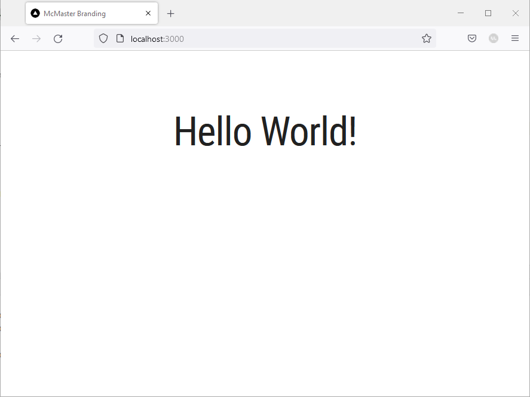

# Typography

We will now learn how to use custom fonts and typography styles in a web application. McMaster recommends the use of the Roboto family of fonts on all websites associated with the university. Roboto is a neo-grotesque sans-serif typeface family developed by Google. There are multiple variants of the Roboto font that are used for different headlines, subheads and body text when designing a new webpage. In this section, we will learn how to use the MUI Typography component to define different heading styles.

## Create `theme.ts`
In the root directory of your project, create a new directory named `config`. You can create the folder using the command line (`mkdir config`) or the GUI.
Navigate to the newly created `config` directory, and create a new file called `theme.ts` in this directory.

Add the following code snippet to  `theme.ts`:
```ts
import {Roboto, Roboto_Condensed} from "next/font/google";

const roboto = Roboto({
    weight: ['400', '900'],
    style: ['normal', 'italic'],
    subsets: ['latin'],
    display: 'swap',
})

const roboto_condensed = Roboto_Condensed({
    weight: ['400', '700'],
    style: ['normal', 'italic'],
    subsets: ['latin'],
    display: 'swap',
})

declare module '@mui/material/Typography' {
    interface TypographyPropsVariantOverrides {
        settingTitle: true;
    }
}

const themeOptions = {
    typography: {
        h1: {
            fontFamily: roboto_condensed.style.fontFamily,
            fontSize: '50pt',
            fontWeight: 400,
        },
        h2: {
            fontFamily: roboto_condensed.style.fontFamily,
            fontSize: '28pt',
            fontWeight: 400,
        },
        h3: {
            fontFamily: roboto_condensed.style.fontFamily,
            fontSize: '20pt',
            fontWeight: 400,
        },
        h4: {
            fontFamily: roboto.style.fontFamily,
            fontSize: '13pt',
            fontWeight: 900,
        },
        button: {
            fontFamily: roboto_condensed.style.fontFamily,
            fontWeight: 700,
        },
        settingTitle: {
            fontFamily: roboto_condensed.style.fontFamily,
            fontSize: '15pt',
        },
    },
}

export default themeOptions
```

In this code snippet, we start by importing the Roboto font variants that we need using the `next/font/google` package. We then define the different typography variants that can be used in our application. The heading styles conform to the McMaster Digital Brand Standards. The `button` and `settingTitle` typographies define the font style to use for text located in buttons and setting titles respectively. We will cover styling buttons and the "Settings" page in later sections of this learning module.

## Create a Theme Provider Component
We will need to create a custom theme provider component to handle creating a theme with custom typography.

Create a `Provider` directory under the `components` directory. Create a `Provider.tsx` file inside the `Provider` directory and add the following statements to it:

```ts
'use client';

import React from "react";
import {createTheme, ThemeProvider} from '@mui/material/styles'  
import themeOptions from '@/config/theme'
```
Create the `Provider` function:
```ts
export function Provider({ children } : {children: React.ReactNode}) {
	const theme = createTheme({  
	...themeOptions  
	});
}
```
Notice that the theme uses the `themeOptions` defined in and imported from `theme.ts`.

Add the `return` statement as shown below:
```ts
return (
	 <ThemeProvider theme={theme}>
		 {children}
	 </ThemeProvider>
)
```

Your `Provider.tsx` file should now look like this:
```ts
'use client';

import React from "react";
import {createTheme, ThemeProvider} from '@mui/material/styles'
import themeOptions from "@/config/theme";


export function Provider({ children } : {children: React.ReactNode}) {
    const theme = createTheme({
        ...themeOptions
    });

    return (
        <ThemeProvider theme={theme}>
            {children}
        </ThemeProvider>
    )
}
```
Notice that the theme uses the `themeOptions` defined in and imported from `theme.ts`.

## Update `layout.tsx`
Open the `layout.tsx` file located in the `app` directory and add the following import statement:
```ts
import {Provider} from "@/components/Provider/Provider";
```

Update the return statement by wrapping the `children` with `Provider` as shown below:
```ts
return (
        <html lang="en">
        <body>
        <Provider>
            {children}
        </Provider>
        </body>
        </html>
    )
```

## Use the Typography Component
Open the `page.tsx` file and add the following import statement to import the MUI Typography component:
```
import Typography from '@mui/material/Typography'
```
Delete line 15 and replace it with the following line of code:
```
<Typography variant="h1">Hello World!</Typography>
```

Go back the browser. The "Hello World" text should now use the `h1` style defined in `theme.ts`:

You can use any the typography styles defined in `theme.ts` by specifying the variant in the `Typography` component. You can also define additional styles and use them in your website.
